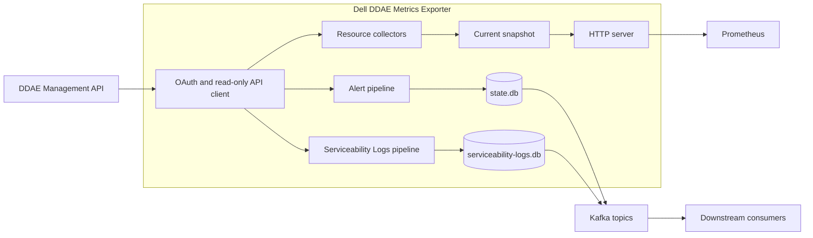

# Dell DDAE Metrics Exporter

English | [繁體中文](README.zh-TW.md)

Dell DDAE Metrics Exporter is a read-only Go service that collects operational
data from Dell Data Domain Active Enterprise (DDAE) 1.5.0, exposes Prometheus
metrics, and publishes typed serviceability records to Kafka.

## Overview

The exporter runs as one process for one DDAE target. It authenticates through
the `dv-admin-rest` OAuth password-grant client, polls a fixed Management API
allowlist, and serves the latest monitoring state on port `9469` by default.

Platform engineers, SRE teams, and operators can use it to connect DDAE with
their Prometheus and Kafka-based observability systems. Prometheus reads current
resource state directly from the exporter. Kafka consumers can use alert and
Serviceability Log events for downstream indexing and alerting workflows.

## Key Features

- **Resource monitoring** — Collects API availability, cluster configuration,
  node state and capacity, system lock state, and appliance readiness.
- **Prometheus metrics** — Exposes resource, collection, pipeline, and Kafka
  delivery metrics through `GET /metrics`.
- **Serviceability alerts** — Reads issue list/detail records and publishes
  normalized alert events to a dedicated Kafka topic.
- **Serviceability Logs** — Reads event list/detail records and publishes them
  through an independent Kafka topic and state path.
- **Independent pipelines** — Resources, alerts, and Serviceability Logs have
  separate enable switches and collection intervals.
- **Durable delivery** — Separate bbolt outboxes retain Kafka records until
  broker acknowledgement.
- **Configurable API prefixes** — Independent Ping and Management API prefixes
  support the default, RC2, and Dell PDF route layouts.
- **Strict YAML configuration** — Versioned YAML validates field names, types,
  ranges, and timing relationships before the service starts.
- **Secure transport** — DDAE and Kafka use TLS 1.2 or later, with custom CA,
  Kafka mTLS, and Kafka PLAIN or SCRAM SASL options.
- **Deployment profiles** — Includes a non-root scratch container, Kubernetes
  manifests, and a hardened systemd unit.

## Architecture



- The API client owns authentication, TLS, request bounds, retries, and the
  fixed operation allowlist.
- Resource collectors update an in-memory snapshot. Prometheus scrapes read the
  snapshot through the HTTP server.
- Alert and Serviceability Log pipelines use separate bbolt databases and Kafka
  topics.
- Kafka consumers own downstream processing such as OpenSearch upserts and
  alert delivery.

## Technology Stack

| Layer | Technology | Purpose |
|---|---|---|
| Language and runtime | Go 1.26.6 | Exporter process and development tooling |
| HTTP | Go `net/http` | Metrics, liveness, and readiness endpoints |
| Metrics | Prometheus Go client | Prometheus/OpenMetrics exposition |
| Messaging | Kafka with `franz-go` | Alert and Serviceability Log delivery |
| Local state | bbolt | Durable outboxes and checkpoints |
| Configuration | YAML v3 and environment variables | Strict runtime configuration |
| Resource parsing | Kubernetes apimachinery | CPU, memory, and storage quantities |
| Packaging | Multi-stage Docker build and scratch runtime | Static non-root container |
| Deployment | Kubernetes manifests and systemd | Container and Linux VM profiles |
| CI/CD | GitHub Actions | Local gates and authorized integration jobs |

## Project Structure

```text
.
├── cmd/ddae-exporter/       # Process entry point
├── internal/                # Configuration, API client, pipelines, metrics, state, and HTTP server
├── integration/             # Authorized integration and deployment E2E test entry points
├── testdata/ddae-1.5.0/     # Sanitized DDAE fixtures for local tests
├── deploy/kubernetes/       # ConfigMap, workload, Service, and NetworkPolicy
├── deploy/systemd/          # Complete YAML example and hardened systemd unit
├── docs/runbook.md          # Operations, troubleshooting, upgrade, and recovery guide
├── scripts/                 # Build, test, security, and supply-chain stages
├── Dockerfile               # Reproducible non-root container build
└── go.mod                   # Go module, dependencies, and toolchain version
```

## Getting Started

The following procedure builds a resources-only instance from source. This mode
provides Prometheus resource metrics through the DDAE and exporter HTTP
interfaces.

### Prerequisites

| Requirement | Version | Required for | Verification |
|---|---|---|---|
| Git | — | Source checkout | `git --version` |
| Go | Exact toolchain `go1.26.6` | Source build, test, and run | `go version` |
| Bash | — | Project scripts | `bash --version` |
| curl | — | Runtime verification | `curl --version` |
| DDAE | System Software 1.5.0 | Every runtime mode | Confirm with the DDAE operator |
| DDAE credentials | Read-only username, password, and `dv-admin-rest` client secret | Every runtime mode | Confirm file availability before startup |
| Kafka | — | Alert or Serviceability Log pipeline | Confirm broker, topic, TLS, and ACL details |
| Docker | — | Container profile | `docker version` |
| Kubernetes CLI | Cluster-compatible version | Kubernetes profile | `kubectl version --client` |
| systemd | Linux host-provided version | VM/systemd profile | `systemctl --version` |

Use the tools required by the installation path you select. The source-based
Getting Started path uses Git, Go, Bash, curl, and access to DDAE.

### Prepare DDAE access

Obtain these values from the DDAE administrator:

- DDAE 1.5.0 HTTPS origin, for example `https://ddae.example.com`.
- Stable DNS name matching the DDAE TLS certificate.
- Read-only DDAE username and password.
- Client secret for the fixed `dv-admin-rest` OAuth client.
- PEM CA bundle when DDAE uses a private certificate authority.
- Route layout used by the deployed gateway. The default is `/ping` and
  `/v1/*`; [DDAE path compatibility](#ddae-path-compatibility) lists alternatives.

Check DNS, TCP, and TLS reachability by requesting the configured Ping route:

```bash
DDAE_BASE_URL="https://<ddae-host>"
curl --silent --show-error --output /dev/null \
  --write-out 'HTTP %{http_code}\n' "${DDAE_BASE_URL}/ping"
unset DDAE_BASE_URL
```

An HTTP response confirms that curl reached the TLS endpoint. The exporter
performs the authenticated request after startup.

### Prepare network access

| Direction | Destination | Purpose |
|---|---|---|
| Outbound | DDAE HTTPS origin and configured port | OAuth and Management API requests |
| Outbound | Configured Kafka broker addresses | Enabled alert or Serviceability Log delivery |
| Inbound | Exporter TCP `9469` by default | Prometheus, liveness, and readiness requests |

Keep the default loopback listener for local use. Container and Kubernetes
profiles use `0.0.0.0:9469` inside their isolated network boundary.

### Clone and build

```bash
git clone https://github.com/crispkid/Dell-DDAE-Metrics-Exporter.git
cd Dell-DDAE-Metrics-Exporter
go mod download
./scripts/build.sh
```

The build creates `bin/ddae-exporter`. Confirm the binary exists:

```bash
test -x bin/ddae-exporter
```

### Create runtime directories

The local workflow stores credential files under the Git-ignored `secrets/`
directory. `trust/` can hold local CA bundles, and `state/` can be used when a
Kafka pipeline is enabled.

```bash
install -d -m 0700 secrets trust state
pwd
```

Record the absolute path printed by `pwd`; the YAML credential and state paths
use absolute paths.

### Create DDAE credential files

Each credential file contains exactly one raw UTF-8 value. The commands below
collect values without displaying passwords and set file mode `0600`.

```bash
printf 'DDAE username: '
IFS= read -r DDAE_USERNAME_VALUE
printf 'DDAE password: '
IFS= read -r -s DDAE_PASSWORD_VALUE
printf '\nDDAE dv-admin-rest client secret: '
IFS= read -r -s DDAE_CLIENT_SECRET_VALUE
printf '\n'

printf '%s' "$DDAE_USERNAME_VALUE" > secrets/ddae-username
printf '%s' "$DDAE_PASSWORD_VALUE" > secrets/ddae-password
printf '%s' "$DDAE_CLIENT_SECRET_VALUE" > secrets/ddae-client-secret
chmod 0600 secrets/ddae-username secrets/ddae-password secrets/ddae-client-secret
unset DDAE_USERNAME_VALUE DDAE_PASSWORD_VALUE DDAE_CLIENT_SECRET_VALUE
```

| File | Example content |
|---|---|
| `secrets/ddae-username` | `<DDAE_USERNAME>` |
| `secrets/ddae-password` | `<DDAE_PASSWORD>` |
| `secrets/ddae-client-secret` | `<DV_ADMIN_REST_CLIENT_SECRET>` |

Use values supplied by the deployment's secret manager. The exporter accepts a
regular credential file up to 64 KiB and removes one trailing newline sequence.

### Install a private CA

When DDAE uses a private CA, copy its PEM bundle into the local trust directory:

```bash
install -m 0644 /path/from/administrator/ddae-ca.pem trust/ddae-ca.pem
```

Add the absolute `trust/ddae-ca.pem` path as `ddae.tls.ca_file` in the YAML.
System-trusted certificates use the host's existing root pool.

### Prepare Kafka pipelines

Complete this step when enabling Alerts or Serviceability Logs. Obtain or
provision:

- One to 64 TLS Kafka broker addresses.
- A dedicated Alert topic for `kafka.topic` when Alerts are enabled.
- A separate Serviceability Log topic for
  `kafka.serviceability_logs_topic` when that pipeline is enabled.
- Producer ACLs for the configured identity and topics.
- Kafka CA bundle, optional mTLS certificate/key pair, and optional SASL
  credentials required by the broker.
- A writable absolute `state.dir` on a filesystem with file locking and fsync.
- A stable `ddae.source_instance` value for Kafka event identity.

Create a Kafka SASL password file when the broker uses PLAIN or SCRAM:

```bash
printf 'Kafka SASL password: '
IFS= read -r -s KAFKA_PASSWORD_VALUE
printf '\n'
printf '%s' "$KAFKA_PASSWORD_VALUE" > secrets/kafka-password
chmod 0600 secrets/kafka-password
unset KAFKA_PASSWORD_VALUE
```

Use [`deploy/systemd/config.example.yaml`](deploy/systemd/config.example.yaml)
to set the brokers, topics, TLS/SASL values, state directory, and selected
pipelines. After startup, `/readyz` and the Kafka pipeline metrics confirm
collection, state, and broker delivery readiness.

### Create a resources-only configuration

Save the following as `config.local.yaml`. Replace the origin and credential
paths with values from the previous steps.

<!-- quick-start-config:start -->
```yaml
version: 1

monitoring:
  resources:
    enabled: true
  alerts:
    enabled: false
  serviceability_logs:
    enabled: false

server:
  listen_address: 127.0.0.1:9469

ddae:
  base_url: https://ddae.example.invalid
  paths:
    ping_prefix: ""
    api_prefix: /v1
  credentials:
    username_file: /absolute/path/to/secrets/ddae-username
    password_file: /absolute/path/to/secrets/ddae-password
    client_secret_file: /absolute/path/to/secrets/ddae-client-secret
```
<!-- quick-start-config:end -->

Protect the configuration file:

```bash
chmod 0600 config.local.yaml
```

The complete configuration example is
[`deploy/systemd/config.example.yaml`](deploy/systemd/config.example.yaml).

### Start the exporter

```bash
./bin/ddae-exporter --config ./config.local.yaml
```

The process writes structured logs to standard output. Keep this terminal open
while completing the verification steps.

### Verify the installation

Open a second terminal and run:

```bash
curl --fail --silent --show-error http://127.0.0.1:9469/healthz
curl --include http://127.0.0.1:9469/readyz
curl --silent http://127.0.0.1:9469/metrics
```

Expected results:

| Check | Successful result |
|---|---|
| `GET /healthz` | HTTP `200` with `alive` |
| `GET /readyz` | HTTP `200` with `ready` after the first complete DDAE collection |
| `GET /metrics` | Prometheus output containing `ddae_build_info`, `ddae_monitoring_enabled`, and resource metrics |
| Exporter log | `DDAE exporter started` startup message |

Installation checklist:

- The exporter process remains running.
- DDAE authentication and the enabled resource collectors complete successfully.
- `/healthz` and `/readyz` return HTTP `200`.
- `/metrics` contains current resource and collector series.
- The credential files remain readable only by the intended local account.

## Configuration Reference

### Configuration locations

| Runtime profile | Configuration | Secrets | State |
|---|---|---|---|
| Local source run | `config.local.yaml` | Absolute local file paths | Optional local absolute path |
| Container | Mounted YAML such as `/etc/ddae-exporter/config.yaml` | Read-only mounts under `/run/secrets` | Writable `/var/lib/ddae-exporter` mount |
| Kubernetes | [`deploy/kubernetes/configmap.yaml`](deploy/kubernetes/configmap.yaml) | Referenced Kubernetes Secrets | ReadWriteOnce PVC at `/var/lib/ddae-exporter` |
| systemd | `/etc/ddae-exporter/config.yaml` | systemd `LoadCredential=` files | Managed `StateDirectory=ddae-exporter` |

Copy the complete systemd-oriented example when preparing a full configuration:

```bash
cp deploy/systemd/config.example.yaml config.local.yaml
chmod 0600 config.local.yaml
```

Replace every `.invalid`, `replace-with-*`, credential path, CA path, broker,
topic, and pipeline selection before startup.

### File selection and precedence

YAML uses schema `version: 1`, UTF-8, one document, and a maximum file size of
1 MiB. The loader validates all settings before opening the HTTP listener or
starting workers.

Configuration precedence, highest first:

1. Individual environment variables.
2. YAML selected by `--config <path>`.
3. YAML selected by `DDAE_EXPORTER_CONFIG_FILE`.
4. Built-in defaults.

All settings are loaded at process startup. Restart the exporter after changing
YAML, environment variables, credentials, certificates, topics, or limits.

### Pipeline settings

At least one pipeline must be enabled.

| YAML key | Required | Default / accepted values | Purpose |
|---|:---:|---|---|
| `monitoring.resources.enabled` | No | `true` | Collect DDAE resource data and expose resource metrics |
| `monitoring.resources.interval` | No | `30s`, positive Go duration | Resource collection interval |
| `monitoring.resources.stale_after` | No | `120s`, greater than resource interval | Maximum age of the current resource snapshot |
| `monitoring.alerts.enabled` | No | `true` | Enable issue list/detail collection, alert state, and Kafka delivery |
| `monitoring.alerts.interval` | No | `30s`, positive Go duration | Alert list collection interval |
| `monitoring.alerts.list_response_max_bytes` | No | `8388608`, range `1–67108864` | Alert list response limit in bytes |
| `monitoring.alerts.detail.response_max_bytes` | No | `1048576`, range `1–67108864` | One alert detail response limit in bytes |
| `monitoring.alerts.detail.refresh_interval` | No | `10m`, at least alert interval | Refresh interval for known alerts |
| `monitoring.alerts.detail.max_per_cycle` | No | `200`, range `1–10000` | Detail records processed per cycle |
| `monitoring.alerts.detail.concurrency` | No | `4`, range `1–128` | Concurrent detail requests; at most `max_per_cycle` |
| `monitoring.serviceability_logs.enabled` | No | `false` | Enable Serviceability Log collection, state, and Kafka delivery |
| `monitoring.serviceability_logs.interval` | No | `30s`, positive Go duration | Serviceability Log list collection interval |
| `monitoring.serviceability_logs.list_response_max_bytes` | No | `8388608`, range `1–67108864` | Log list response limit in bytes |
| `monitoring.serviceability_logs.detail.response_max_bytes` | No | `1048576`, range `1–67108864` | One Log detail response limit in bytes |
| `monitoring.serviceability_logs.detail.refresh_interval` | No | `10m`, at least Log interval | Refresh interval for known Logs |
| `monitoring.serviceability_logs.detail.max_per_cycle` | No | `200`, range `1–10000` | Detail records processed per cycle |
| `monitoring.serviceability_logs.detail.concurrency` | No | `4`, range `1–128` | Concurrent detail requests; at most `max_per_cycle` |

Duration values use Go syntax such as `500ms`, `5s`, `10m`, and `720h`.
Configured timings follow these relationships:

```text
ddae.request_timeout < ddae.cycle_timeout < each enabled pipeline interval
monitoring.resources.interval < monitoring.resources.stale_after
monitoring.alerts.detail.refresh_interval >= monitoring.alerts.interval
monitoring.serviceability_logs.detail.refresh_interval >= monitoring.serviceability_logs.interval
```

### Server, security, and logging settings

| YAML key | Required | Default / accepted values | Purpose |
|---|:---:|---|---|
| `server.listen_address` | No | `127.0.0.1:9469`, explicit `host:port`, port `1–65535` | Exporter HTTP listener |
| `server.shutdown_grace_period` | No | `15s`, positive Go duration | Graceful shutdown budget |
| `security.allow_insecure_tls` | No | `false` | Global acknowledgement for target-specific TLS diagnostic mode |
| `logging.level` | No | `info`; `debug`, `info`, `warn`, `error` | Minimum application log level |
| `logging.format` | No | `json`; `json` or `text` | Log encoding |

### DDAE settings

| YAML key | Required | Default / accepted values | Purpose |
|---|:---:|---|---|
| `ddae.base_url` | Yes | HTTPS origin without path, query, fragment, or user information | DDAE Management API origin |
| `ddae.paths.ping_prefix` | No | Empty string | Prefix inserted before fixed `/ping` suffix |
| `ddae.paths.api_prefix` | No | `/v1` | Prefix inserted before other fixed API suffixes |
| `ddae.source_instance` | Kafka pipeline | 1–128 valid UTF-8 bytes | Stable source identity in Kafka events |
| `ddae.credentials.username_file` | Yes* | Readable regular file | DDAE read-only username |
| `ddae.credentials.password_file` | Yes* | Readable regular file | DDAE read-only password |
| `ddae.credentials.client_secret_file` | Yes* | Readable regular file | `dv-admin-rest` client secret |
| `ddae.tls.ca_file` | No | System roots or PEM CA path | Additional DDAE trust roots |
| `ddae.tls.insecure_skip_verify` | No | `false`; requires global acknowledgement | Target-specific TLS diagnostic mode |
| `ddae.request_timeout` | No | `5s`, positive Go duration | Deadline for one token or API request |
| `ddae.cycle_timeout` | No | `20s`, positive Go duration | Aggregate deadline for one collection cycle |
| `ddae.response_max_bytes` | No | `4194304`, range `1–67108864` | General DDAE response limit in bytes |
| `ddae.retry_max` | No | `2`, range `0–10` | Retries after the initial safe request |

`Yes*` accepts either the YAML file setting or its corresponding direct secret
environment variable. File-based values are used by the deployment profiles.

### DDAE path compatibility

`ddae.paths.ping_prefix` and `ddae.paths.api_prefix` can be overridden by
`DDAE_PING_PATH_PREFIX` and `DDAE_API_PATH_PREFIX`.

| Route layout | `ping_prefix` | `api_prefix` | Ping request | API example |
|---|---|---|---|---|
| Default | `""` | `/v1` | `GET /ping` | `GET /v1/ddae-clusters` |
| RC2 compatibility | `/rest/v1` | `/rest/v1` | `GET /rest/v1/ping` | `GET /rest/v1/ddae-clusters` |
| Dell PDF form | `/rest` | `/rest/v1` | `GET /rest/ping` | `GET /rest/v1/ddae-clusters` |

A prefix may be empty. A non-empty prefix has a maximum length of 128 bytes and
uses a canonical ASCII absolute path form: one leading slash, no trailing slash,
and segments containing only letters, digits, `.`, `_`, `~`, or `-`. Route
selection is deterministic. Each operation combines its configured prefix with
one fixed suffix, without runtime discovery or alternate-path fallback.

### Kafka settings

Kafka settings are required when alerts or Serviceability Logs are enabled.

| YAML key | Required | Default / accepted values | Purpose |
|---|:---:|---|---|
| `kafka.brokers` | Kafka pipeline | 1–64 broker addresses | Kafka bootstrap brokers |
| `kafka.topic` | Alerts | Maximum 249 bytes | Dedicated alert topic |
| `kafka.serviceability_logs_topic` | No | `ddae-serviceability-logs`, maximum 249 bytes | Dedicated Log topic; distinct from alert topic |
| `kafka.client_id` | No | `ddae-exporter`, 1–128 bytes | Kafka client identity |
| `kafka.tls.ca_file` | No | System roots or PEM CA path | Additional Kafka trust roots |
| `kafka.tls.client_cert_file` | mTLS | PEM certificate path | Kafka client certificate |
| `kafka.tls.client_key_file` | mTLS | PEM private-key path | Key paired with the client certificate |
| `kafka.tls.insecure_skip_verify` | No | `false`; requires global acknowledgement | Target-specific TLS diagnostic mode |
| `kafka.sasl.mechanism` | No | Empty, `PLAIN`, `SCRAM-SHA-256`, `SCRAM-SHA-512` | Kafka SASL mechanism |
| `kafka.sasl.username` | SASL | Non-empty string | Kafka SASL identity |
| `kafka.sasl.password_file` | SASL | Readable regular file | Kafka SASL password |
| `kafka.publish_timeout` | No | `10s`, minimum `1s` | Hard broker acknowledgement deadline |

The producer uses TLS, `acks=all`, idempotent production settings, per-key
ordering, and bounded in-memory buffering.

### State settings

When a Kafka pipeline starts for the first time, the exporter creates its bbolt
database and schema metadata automatically. Alerts use `state.db`; Serviceability
Logs use `serviceability-logs.db`. Run one exporter writer per state directory.

| YAML key | Required | Default / accepted values | Purpose |
|---|:---:|---|---|
| `state.dir` | No | `/var/lib/ddae-exporter`, writable absolute path | Directory containing both state databases |
| `state.outbox_max_bytes` | No | `1073741824`, positive bytes | Alert outbox byte limit |
| `state.outbox_max_events` | No | `100000`, range `1–10000000` | Alert outbox record limit |
| `state.checkpoint_retention` | No | `720h`, positive Go duration | Retention after an alert leaves a complete list |
| `state.checkpoint_max_alerts` | No | `100000`, range `1–10000000` | Alert checkpoint limit |
| `state.serviceability_logs_outbox_max_bytes` | No | `1073741824`, positive bytes | Log outbox byte limit |
| `state.serviceability_logs_outbox_max_events` | No | `100000`, range `1–10000000` | Log outbox record limit |
| `state.serviceability_logs_checkpoint_retention` | No | `720h`, positive Go duration | Retention after a Log leaves a complete list |
| `state.serviceability_logs_checkpoint_max_records` | No | `100000`, range `1–10000000` | Log checkpoint limit |

Use a local or ReadWriteOnce filesystem with file locking, fsync support, and
capacity for the enabled outbox limits plus database overhead.

### Secret files and TLS

- DDAE credentials and the optional Kafka SASL password use regular runtime
  files containing one UTF-8 value.
- File mode `0600` and a parent directory restricted to the exporter account
  provide an appropriate local permission baseline.
- DDAE and Kafka verify certificates and hostnames with TLS 1.2 or later.
- Custom CA files extend the system trust pool.
- Kafka mTLS loads the client certificate and private key as a required pair.
- Diagnostic TLS mode requires both `security.allow_insecure_tls: true` and the
  selected target's `insecure_skip_verify: true`.

### Environment variables

Environment variables provide the complete environment-only interface and
override corresponding YAML values. File-based values are the deployment
interface for secrets.

| Group | Environment variables |
|---|---|
| Configuration selector | `DDAE_EXPORTER_CONFIG_FILE` |
| Pipeline switches | `DDAE_RESOURCE_MONITORING_ENABLED`, `DDAE_ALERT_MONITORING_ENABLED`, `DDAE_SERVICEABILITY_LOG_MONITORING_ENABLED` |
| Pipeline intervals | `DDAE_COLLECTION_INTERVAL`, `DDAE_RESOURCE_COLLECTION_INTERVAL`, `DDAE_ALERT_COLLECTION_INTERVAL`, `DDAE_SERVICEABILITY_LOG_COLLECTION_INTERVAL`, `DDAE_STALE_AFTER` |
| Alert limits | `ALERT_LIST_RESPONSE_MAX_BYTES`, `ALERT_DETAIL_RESPONSE_MAX_BYTES`, `ALERT_DETAIL_REFRESH_INTERVAL`, `ALERT_DETAIL_MAX_PER_CYCLE`, `ALERT_DETAIL_CONCURRENCY` |
| Log limits | `SERVICEABILITY_LOG_LIST_RESPONSE_MAX_BYTES`, `SERVICEABILITY_LOG_DETAIL_RESPONSE_MAX_BYTES`, `SERVICEABILITY_LOG_DETAIL_REFRESH_INTERVAL`, `SERVICEABILITY_LOG_DETAIL_MAX_PER_CYCLE`, `SERVICEABILITY_LOG_DETAIL_CONCURRENCY` |
| DDAE | `DDAE_BASE_URL`, `DDAE_PING_PATH_PREFIX`, `DDAE_API_PATH_PREFIX`, `DDAE_SOURCE_INSTANCE`, `DDAE_CA_FILE`, `DDAE_TLS_INSECURE_SKIP_VERIFY`, `DDAE_REQUEST_TIMEOUT`, `DDAE_CYCLE_TIMEOUT`, `DDAE_RESPONSE_MAX_BYTES`, `DDAE_RETRY_MAX` |
| DDAE credentials | `DDAE_USERNAME`, `DDAE_PASSWORD`, `DDAE_CLIENT_SECRET`, `DDAE_USERNAME_FILE`, `DDAE_PASSWORD_FILE`, `DDAE_CLIENT_SECRET_FILE` |
| Kafka | `KAFKA_BROKERS`, `KAFKA_TOPIC`, `KAFKA_SERVICEABILITY_LOG_TOPIC`, `KAFKA_CLIENT_ID`, `KAFKA_PUBLISH_TIMEOUT` |
| Kafka TLS | `KAFKA_CA_FILE`, `KAFKA_CLIENT_CERT_FILE`, `KAFKA_CLIENT_KEY_FILE`, `KAFKA_TLS_INSECURE_SKIP_VERIFY` |
| Kafka SASL | `KAFKA_SASL_MECHANISM`, `KAFKA_SASL_USERNAME`, `KAFKA_SASL_PASSWORD`, `KAFKA_SASL_PASSWORD_FILE` |
| State | `STATE_DIR`, `KAFKA_OUTBOX_MAX_BYTES`, `KAFKA_OUTBOX_MAX_EVENTS`, `CHECKPOINT_RETENTION`, `CHECKPOINT_MAX_ALERTS` |
| Log state | `SERVICEABILITY_LOG_OUTBOX_MAX_BYTES`, `SERVICEABILITY_LOG_OUTBOX_MAX_EVENTS`, `SERVICEABILITY_LOG_CHECKPOINT_RETENTION`, `SERVICEABILITY_LOG_CHECKPOINT_MAX_RECORDS` |
| Server and logging | `EXPORTER_LISTEN_ADDRESS`, `SHUTDOWN_GRACE_PERIOD`, `LOG_LEVEL`, `LOG_FORMAT` |
| TLS acknowledgement | `ALLOW_INSECURE_TLS` |

Direct secret environment variables and their corresponding `*_FILE` variables
are mutually exclusive. `DDAE_COLLECTION_INTERVAL` is the legacy shared alias;
the resource-specific and alert-specific interval variables take precedence.

## Usage and Interfaces

### Exporter HTTP endpoints

| Method | Endpoint | Purpose | Successful response |
|---|---|---|---|
| `GET` | `/metrics` | Prometheus/OpenMetrics output | HTTP `200` with metric exposition |
| `GET` | `/healthz` | Process liveness | HTTP `200` with `alive` |
| `GET` | `/readyz` | Readiness of all enabled pipelines | HTTP `200` with `ready` |

Place a non-loopback listener on a controlled network path or behind an
authenticated reverse proxy or service mesh.

### DDAE Management API operations

| Method | Default path | Purpose |
|---|---|---|
| `POST` | `/auth/realms/ddae/protocol/openid-connect/token` | Obtain a bearer token for the `dv-admin-rest` client |
| `GET` | `/ping` | Management API availability |
| `GET` | `/v1/ddae-clusters` | Cluster state and Coordinator/Worker configuration |
| `GET` | `/v1/infrastructure-nodes` | Node state, capacity, allocatable resources, and conditions |
| `GET` | `/v1/system-lock` | Appliance lock state |
| `GET` | `/v1/system-shutdown` | Control-plane and node readiness |
| `GET` | `/v1/serviceability-issues` | Alert identifiers |
| `GET` | `/v1/serviceability-issues/{id}` | One validated alert detail record |
| `GET` | `/v1/serviceability-events` | Serviceability Log identifiers |
| `GET` | `/v1/serviceability-events/{id}` | One validated Serviceability Log detail record |

OAuth is the fixed authentication POST. Monitoring uses the nine read-only GET
operations under the configured prefixes.

### Prometheus metrics

Metric names use the `ddae_` prefix.

| Unit | Representation |
|---|---|
| Boolean | `0` or `1` |
| One-hot state | One fixed-state series is `1`; the remaining state series are `0` |
| Duration and age | Seconds, including fractional values |
| Memory and storage | Bytes |
| CPU | CPU cores, including fractional values |
| Counts | Non-negative records, nodes, alerts, events, or logs |
| Counters | Non-negative values that increase during one process lifetime |

| Group | Representative metrics |
|---|---|
| Build and pipeline state | `ddae_build_info`, `ddae_monitoring_enabled` |
| Collection | `ddae_collector_success`, `ddae_collector_duration_seconds` |
| Resource freshness | `ddae_up`, `ddae_snapshot_age_seconds`, `ddae_management_api_up` |
| Cluster configuration | `ddae_cluster_coordinator_configured_cpu_cores`, `ddae_cluster_coordinator_configured_memory_bytes` |
| Node capacity | `ddae_node_capacity_cpu_cores`, `ddae_node_capacity_memory_bytes`, `ddae_node_capacity_ephemeral_storage_bytes` |
| Appliance readiness | `ddae_system_locked`, `ddae_control_plane_ready`, `ddae_nodes_ready`, `ddae_nodes_total` |
| Alert delivery | `ddae_alert_pipeline_ready`, `ddae_kafka_events_published_total`, `ddae_kafka_buffered_events` |
| Log delivery | `ddae_serviceability_log_pipeline_ready`, `ddae_serviceability_log_records_published_total`, `ddae_serviceability_log_buffered_records` |

CPU, memory, and storage series describe configured, capacity, and allocatable
values returned by DDAE.

### Kafka events

Alerts use schema `1.0` and event type
`ddae.serviceability_alert.upsert`. Serviceability Logs use schema `1.0` and
event type `ddae.serviceability_log.upsert`. Both record types contain
normalized, bounded fields and deterministic keys.

Representative alert value:

```json
{
  "schema_version": "1.0",
  "event_type": "ddae.serviceability_alert.upsert",
  "source_system": "dell_ddae",
  "source_instance": "<stable-ddae-name>",
  "alert_id": "<alert-id>",
  "content_hash_sha256": "<64-character-lowercase-sha256>",
  "observed_at": "2026-01-01T00:00:00Z",
  "alert": {
    "severity": "warning",
    "acknowledged": false,
    "occurrence_count": 1,
    "message": "<normalized-alert-message>",
    "reason": "<normalized-alert-reason>",
    "remedies": ["<recommended-action>"]
  }
}
```

Kafka records include `content-type: application/json` and
`ddae-schema-version: 1.0` headers. Serviceability Log records also include
`ddae-record-kind: serviceability_log`. Consumers perform idempotent upserts by
record key to handle a repeated at-least-once delivery safely.

## Development

Run project commands from the Repository root.

| Task | Command | Result |
|---|---|---|
| Download dependencies | `go mod download` | Populates the Go module cache |
| Format check and static analysis | `./scripts/stage-lint.sh` | Runs `gofmt` check and `go vet` |
| Unit and component tests | `./scripts/stage-test.sh` | Runs `go test -race ./...` |
| Coverage gate | `./scripts/stage-coverage.sh` | Creates `coverage/coverage.out` and applies the 80% gate |
| Build | `./scripts/build.sh` | Creates `bin/ddae-exporter` |
| Reproducible build check | `./scripts/reproducible-build.sh` | Builds twice and compares output |
| CI policy | `./scripts/stage-ci-policy.sh` | Validates the committed GitHub Actions policy |
| Security policy | `./scripts/security-policy.sh` | Validates security contracts and runs `govulncheck` |
| Supply chain | `./scripts/supply-chain.sh` | Verifies modules, build reproducibility, and CycloneDX SBOM generation |

Install the pinned tools used by the security and supply-chain stages:

```bash
go install golang.org/x/vuln/cmd/govulncheck@v1.7.0
go install github.com/CycloneDX/cyclonedx-gomod/cmd/cyclonedx-gomod@v1.10.0
```

The local unit and component suite uses recording HTTP servers, test doubles,
and sanitized fixtures. Authorized non-production runners execute integration
and deployment E2E stages through the opt-in GitHub Actions workflow described
in the [runbook](docs/runbook.md#verification-status).

The supply-chain stage runs from a clean committed worktree so its checksums and
provenance identify one exact source revision.

## Build

Build metadata can be supplied through environment variables:

```bash
VERSION="<version>" \
REVISION="<git-revision>" \
BUILD_DATE="<UTC-RFC3339-timestamp>" \
./scripts/build.sh
```

The build uses `CGO_ENABLED=0`, `-trimpath`, and the Go toolchain pinned by
`go.mod`.

## Deployment

### Container

Build the image:

```bash
docker build -t ddae-exporter:dev .
```

Copy the verified local configuration, then update its listener and mounted
paths:

```bash
cp config.local.yaml config.container.yaml
```

Use these values in `config.container.yaml`:

```yaml
server:
  listen_address: 0.0.0.0:9469
ddae:
  credentials:
    username_file: /run/secrets/ddae-username
    password_file: /run/secrets/ddae-password
    client_secret_file: /run/secrets/ddae-client-secret
state:
  dir: /var/lib/ddae-exporter
```

Prepare mounts readable and writable by the image's UID/GID `65532`. This Linux
example copies the local DDAE credentials into a container-specific directory:

```bash
sudo install -d -m 0700 -o 65532 -g 65532 \
  secrets/container trust/container state/container
sudo install -m 0400 -o 65532 -g 65532 \
  secrets/ddae-username secrets/container/ddae-username
sudo install -m 0400 -o 65532 -g 65532 \
  secrets/ddae-password secrets/container/ddae-password
sudo install -m 0400 -o 65532 -g 65532 \
  secrets/ddae-client-secret secrets/container/ddae-client-secret
```

Copy any configured CA bundle into `trust/container` with read access for UID
`65532`.

Start the container:

```bash
docker run --rm \
  --name ddae-exporter \
  --read-only \
  --user 65532:65532 \
  --publish 127.0.0.1:9469:9469 \
  --mount type=bind,source="$(pwd)/config.container.yaml",target=/etc/ddae-exporter/config.yaml,readonly \
  --mount type=bind,source="$(pwd)/secrets/container",target=/run/secrets,readonly \
  --mount type=bind,source="$(pwd)/trust/container",target=/run/trust,readonly \
  --mount type=bind,source="$(pwd)/state/container",target=/var/lib/ddae-exporter \
  ddae-exporter:dev --config /etc/ddae-exporter/config.yaml
```

The scratch runtime executes as UID/GID `65532` and exposes port `9469`.

### Kubernetes

The Kubernetes profile provides a ServiceAccount, a ReadWriteOnce PVC, a
single-replica `Recreate` Deployment, a ClusterIP Service, and a default-deny
NetworkPolicy.

Prepare the profile:

1. Update DDAE, Kafka, path-prefix, and pipeline values in
   [`deploy/kubernetes/configmap.yaml`](deploy/kubernetes/configmap.yaml).
2. Replace the example image with an approved immutable image digest in
   [`deploy/kubernetes/deployment.yaml`](deploy/kubernetes/deployment.yaml).
3. Create `ddae-exporter-credentials`, `ddae-exporter-kafka`, and
   `ddae-exporter-trust` Secrets using the keys referenced by the Deployment.
4. Add site-specific DNS, DDAE, Kafka, and Prometheus rules alongside the
   committed default-deny
   [`NetworkPolicy`](deploy/kubernetes/networkpolicy.yaml).
5. Apply the ConfigMap, site policies, NetworkPolicy, and Deployment to the
   authorized namespace.

Example Secret commands, with site-specific namespace and source paths:

```bash
NAMESPACE="<namespace>"
kubectl create namespace "$NAMESPACE"
kubectl -n "$NAMESPACE" create secret generic ddae-exporter-credentials \
  --from-file=username=/path/to/ddae-username \
  --from-file=password=/path/to/ddae-password \
  --from-file=client-secret=/path/to/ddae-client-secret
kubectl -n "$NAMESPACE" create secret generic ddae-exporter-kafka \
  --from-file=password=/path/to/kafka-password
kubectl -n "$NAMESPACE" create secret generic ddae-exporter-trust \
  --from-file=ddae-ca.pem=/path/to/ddae-ca.pem \
  --from-file=kafka-ca.pem=/path/to/kafka-ca.pem
```

Apply the prepared resources:

```bash
NAMESPACE="<namespace>"
SITE_POLICY_FILE="/path/to/ddae-exporter-allow-policy.yaml"
kubectl -n "$NAMESPACE" apply -f deploy/kubernetes/configmap.yaml
kubectl -n "$NAMESPACE" apply -f "$SITE_POLICY_FILE"
kubectl -n "$NAMESPACE" apply -f deploy/kubernetes/networkpolicy.yaml
kubectl -n "$NAMESPACE" apply -f deploy/kubernetes/deployment.yaml
```

Verify the rollout:

```bash
NAMESPACE="<namespace>"
kubectl -n "$NAMESPACE" get deployment ddae-exporter
kubectl -n "$NAMESPACE" get pods -l app.kubernetes.io/name=ddae-exporter
kubectl -n "$NAMESPACE" get service ddae-exporter
kubectl -n "$NAMESPACE" get pvc ddae-exporter-state
kubectl -n "$NAMESPACE" rollout status deployment/ddae-exporter
kubectl -n "$NAMESPACE" logs deployment/ddae-exporter
```

### Linux and systemd

The systemd profile runs as the dedicated `ddae-exporter` account, loads
credentials with `LoadCredential=`, creates `/var/lib/ddae-exporter`, and
applies service hardening directives.

Install the binary, configuration, and unit:

```bash
sudo useradd --system \
  --home-dir /var/lib/ddae-exporter \
  --shell /usr/sbin/nologin \
  ddae-exporter
sudo install -o root -g root -m 0755 bin/ddae-exporter /usr/local/bin/ddae-exporter
sudo install -d -o root -g ddae-exporter -m 0750 /etc/ddae-exporter
sudo install -d -o root -g root -m 0700 /etc/ddae-exporter/secrets
sudo install -d -o root -g root -m 0755 /etc/ddae-exporter/trust
sudo install -o root -g ddae-exporter -m 0640 \
  deploy/systemd/config.example.yaml /etc/ddae-exporter/config.yaml
sudo install -o root -g root -m 0644 \
  deploy/systemd/ddae-exporter.service /etc/systemd/system/ddae-exporter.service
```

Install the credential source files named by the unit:

```bash
sudo install -o root -g root -m 0600 /path/to/ddae-username \
  /etc/ddae-exporter/secrets/ddae-username
sudo install -o root -g root -m 0600 /path/to/ddae-password \
  /etc/ddae-exporter/secrets/ddae-password
sudo install -o root -g root -m 0600 /path/to/ddae-client-secret \
  /etc/ddae-exporter/secrets/ddae-client-secret
sudo install -o root -g root -m 0600 /path/to/kafka-password \
  /etc/ddae-exporter/secrets/kafka-password
```

Update `/etc/ddae-exporter/config.yaml`, install the configured CA bundles
under `/etc/ddae-exporter/trust/`, then start the service:

```bash
sudo systemctl daemon-reload
sudo systemctl enable --now ddae-exporter
sudo systemctl status ddae-exporter
```

Use the [operations runbook](docs/runbook.md) for production preparation,
state backup, upgrade, rollback, and recovery.

## Observability

| Signal | Interface | Operational use |
|---|---|---|
| Metrics | `GET /metrics` | Prometheus resource and pipeline monitoring |
| Liveness | `GET /healthz` | Process health check |
| Readiness | `GET /readyz` | Enabled-pipeline readiness check |
| Logs | Standard output, JSON by default | Structured component and bounded failure-class diagnostics |

Example Prometheus scrape configuration for the default local listener:

```yaml
scrape_configs:
  - job_name: dell-ddae
    scrape_interval: 30s
    static_configs:
      - targets: ["127.0.0.1:9469"]
```

## Security

- DDAE monitoring traffic is restricted to a compiled read-only GET allowlist.
- Credentials are loaded from runtime files and excluded from metrics and
  bounded error output.
- TLS certificate and hostname verification is enabled by default for DDAE and
  Kafka.
- Kafka event fields are typed, size-bounded, and allowlisted.
- The container and Kubernetes profiles run without root or Linux capabilities.
- The Kubernetes service account token is disabled, and the committed
  NetworkPolicy starts with default-deny ingress and egress.
- The systemd profile uses `LoadCredential=`, `NoNewPrivileges=yes`, a strict
  filesystem view, and a private state directory.

## Troubleshooting

### Inspect configuration validation

Run the exporter in the foreground and read the bounded configuration error:

```bash
./bin/ddae-exporter --config ./config.local.yaml
```

Confirm YAML schema version `1`, field names, value types, absolute secret and
state paths, timing relationships, and at least one enabled pipeline.

### Diagnose DDAE HTTP 404

Compare the gateway route layout with `ddae.paths.ping_prefix` and
`ddae.paths.api_prefix`. Restart after selecting the matching row from
[DDAE path compatibility](#ddae-path-compatibility).

### Diagnose authentication

Confirm the credential files exist, contain one value each, and are readable by
the exporter account:

```bash
ls -l secrets/ddae-username secrets/ddae-password secrets/ddae-client-secret
```

### Diagnose TLS validation

Confirm the DDAE hostname matches the certificate and validate the CA bundle:

```bash
DDAE_BASE_URL="https://<ddae-host>"
curl --cacert trust/ddae-ca.pem \
  --silent --show-error --output /dev/null \
  --write-out 'HTTP %{http_code}\n' "${DDAE_BASE_URL}/ping"
unset DDAE_BASE_URL
```

### Diagnose HTTP 503 readiness

Inspect the enabled pipeline and collector metrics:

```bash
curl --silent http://127.0.0.1:9469/metrics | \
  grep -E 'ddae_(monitoring_enabled|collector_success|snapshot_age_seconds|alert_pipeline_ready|serviceability_log_pipeline_ready|kafka_buffered_events)'
```

### Resolve a port 9469 conflict

Identify the listener, then select another explicit `host:port` in
`server.listen_address`:

```bash
lsof -nP -iTCP:9469 -sTCP:LISTEN
```

### Restore Kafka delivery

Check broker reachability, TLS/SASL configuration, topic ACLs, and state volume
capacity. Preserve `state.db` and `serviceability-logs.db` while restoring the
delivery path.

### Inspect Kubernetes readiness

```bash
NAMESPACE="<namespace>"
kubectl -n "$NAMESPACE" get pods -l app.kubernetes.io/name=ddae-exporter
kubectl -n "$NAMESPACE" describe deployment ddae-exporter
kubectl -n "$NAMESPACE" logs deployment/ddae-exporter
```

### Inspect systemd readiness

```bash
sudo systemctl status ddae-exporter
sudo journalctl -u ddae-exporter --no-pager
```

The [runbook troubleshooting table](docs/runbook.md#troubleshooting) provides
recovery steps and state-preservation rules.

## Documentation

- [Complete configuration example](deploy/systemd/config.example.yaml)
- [Operations runbook](docs/runbook.md)
- [Kubernetes ConfigMap](deploy/kubernetes/configmap.yaml)
- [Kubernetes Deployment and Service](deploy/kubernetes/deployment.yaml)
- [Kubernetes NetworkPolicy](deploy/kubernetes/networkpolicy.yaml)
- [systemd unit](deploy/systemd/ddae-exporter.service)
- [Traditional Chinese README](README.zh-TW.md)

## License

Licensed under the [Apache License 2.0](LICENSE).
