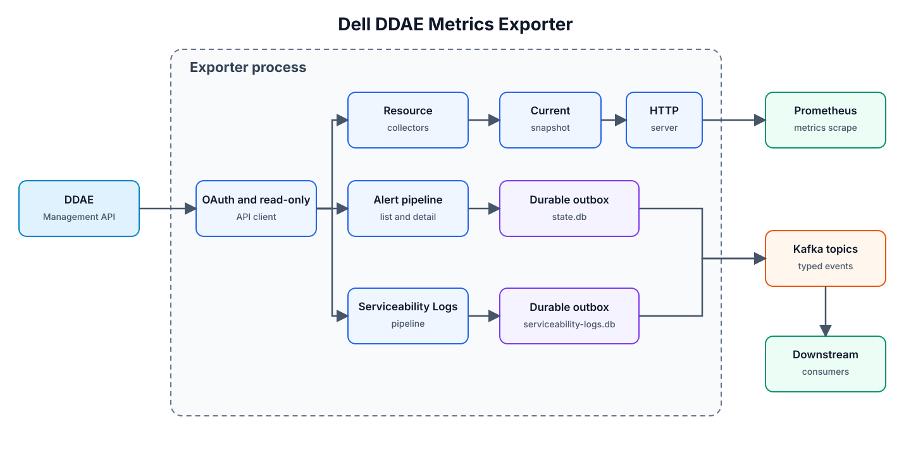

# Dell DDAE Metrics Exporter

English | [繁體中文](README.zh-TW.md)

Collect Dell Data Analytics Engine operational data, expose Prometheus metrics, and deliver typed serviceability and query events to Kafka.

[Getting Started](#getting-started) · [Configuration](#configuration-reference) · [Deployment](#deployment) · [Troubleshooting](#troubleshooting)

## Overview

Dell DDAE Metrics Exporter is a read-only Go service for platform engineers, SREs, and DDAE operators. One process monitors one source appliance. Resource collection uses the DDAE 1.5.0 Management API contract; query monitoring uses a separate Insights session and the response schema observed on engine `479-e.4`.

Start with resource metrics, then enable the alert, Serviceability Log, query, and bounded history-backfill pipelines that fit your environment. Prometheus reads collected snapshots; Kafka consumers handle downstream indexing and notifications.

## Key Features

- **Resource visibility** — Appliance availability, cluster configuration, node readiness, CPU/memory/storage capacity, and system lock state.
- **Prometheus monitoring** — Resource metrics, query concurrency and queue counts, observed query-duration distributions, pipeline health, and delivery metrics.
- **Typed Kafka events** — Independent topics for serviceability alerts, Serviceability Logs, and optional query details.
- **Durable processing** — Local bbolt checkpoints and bounded outboxes support restart recovery and acknowledgement-based delivery.
- **History backfill** — Bounded, resumable scans of Serviceability Log and query history with independent schedules.
- **Explicit configuration** — Strict versioned YAML, per-pipeline controls, Environment Variable overrides, and credential files.
- **Secure connections** — Verified HTTPS, custom CA bundles, Kafka mTLS, and Kafka PLAIN/SCRAM authentication.
- **Deployment profiles** — Static executable, non-root Docker image, Kubernetes manifests, and hardened systemd service.

## Architecture



The diagram shows the Management API pipelines. Resource collectors update an in-memory snapshot for the HTTP server. Alerts and Serviceability Logs pass through separate local outboxes to Kafka.

The query pipeline authenticates independently with Insights and its identity provider, stores query checkpoints, and updates Prometheus metrics. Enabling query events adds a dedicated Kafka topic. History scanners feed the existing Log/query processing paths and persist their progress separately. Kafka consumers own downstream processing.

See the [architecture decision](docs/decisions/0001-ddae-v1-architecture.md), [query guide](docs/query-monitoring.md), and [history-backfill guide](docs/history-backfill.md).

## Technology Stack

| Layer | Technology | Purpose |
|---|---|---|
| Runtime and build | Go 1.26.6 | Static exporter executable and verification tooling |
| HTTP | Go `net/http` | Collection clients, metrics, liveness, and readiness |
| Metrics | Prometheus Go client | Prometheus/OpenMetrics exposition |
| Messaging | Kafka, `franz-go` | Event delivery |
| Local persistence | bbolt | Outboxes, checkpoints, and history progress |
| Configuration | YAML v3, Environment Variables | Strict startup configuration |
| Resource parsing | Kubernetes apimachinery | CPU, memory, and storage quantities |
| Packaging | Multi-stage Docker build, scratch runtime | Minimal non-root image |
| Operations | Kubernetes, systemd, GitHub Actions | Deployment profiles and verification workflows |

## Project Structure

```text
.
├── cmd/ddae-exporter/      # Process entry point
├── internal/              # Clients, collectors, metrics, state, and publishers
├── deploy/                # YAML examples, Kubernetes, and systemd
├── docs/                  # Operations, query, backfill, and architecture guides
├── integration/           # Authorized integration and deployment tests
├── testdata/              # Sanitized API fixtures and event examples
├── scripts/               # Build, test, security, and supply-chain stages
├── HARNESS/               # Verification runner and committed stage policy
├── .github/workflows/     # CI workflow
├── Dockerfile             # Static, non-root container image
└── go.mod                 # Go toolchain and dependency versions
```

## Getting Started

This path builds from source and runs **resource monitoring only** against your DDAE endpoint. It needs a DDAE account and HTTPS connectivity; Kafka is needed when you enable event pipelines. Execute commands from the Repository root, in Bash or zsh, unless a block explicitly starts Bash. Replace every `<...>` placeholder before executing.

### 1. Prepare tools and access

| Requirement | Version / scope | Purpose | Check |
|---|---|---|---|
| macOS or Linux | Source/Harness workflow; Bash 3.2+ | Run the documented shell workflow | `uname -s; uname -m; bash --version` |
| Git | Source checkout | Clone the Repository | `git --version` |
| Go | Build script requires effective toolchain **1.26.6**; module declares Go 1.26.0 | Compile and download modules | `go version; go env GOVERSION GOOS GOARCH` |
| curl | Local verification | Check HTTP endpoints | `curl --version` |
| DDAE Management API | DDAE 1.5.0 contract | Resource, alert, and Log input | Authorized HTTPS origin and account |
| Docker | Optional image workflow | Build/run the Dockerfile | `docker version` |
| kubectl and cluster access | Optional Kubernetes workflow | Apply the committed manifests | `kubectl version --client; kubectl cluster-info` |
| systemd with `LoadCredential` support | Optional Linux service workflow | Run the committed service unit | `systemctl --version` |

Install Git, Bash, and curl with your operating system's package manager. Install Go **1.26.6** for your OS/CPU using the [Go downloads](https://go.dev/dl/) and [installation guide](https://go.dev/doc/install/), then confirm `go version`. The executable is built for the effective `GOOS`/`GOARCH`. Windows contributors can use the Linux workflow in WSL; see [development portability](docs/development-portability.md). For Docker or Kubernetes, install the corresponding CLI/runtime using your platform's installation procedure before continuing.

Ask your DDAE administrator for:

- The HTTPS **origin**, for example `https://ddae.example.invalid`, with its actual port if different from `443`.
- A least-privilege read-only username/password authorized for the required GET endpoints.
- The client secret for the `dv-admin-rest` OAuth client.
- A PEM CA bundle when the endpoint uses a private CA, and the correct Ping/API prefixes.

The exporter host must resolve that hostname, reach the HTTPS port, and trust a certificate whose name matches it. Reserve local TCP port `9469`, or choose another explicit listen address. The local process needs read access to configuration, credential files, and any CA files.

### 2. Obtain the source and build

Clone and record the revision you are using:

```bash
git clone https://github.com/crispkid/Dell-DDAE-Metrics-Exporter.git
cd Dell-DDAE-Metrics-Exporter
git rev-parse HEAD
go version
go mod download
./scripts/build.sh
test -x bin/ddae-exporter
```

The result is `bin/ddae-exporter`. Module downloads require access to your configured Go module sources; a compiler/runtime installation is separate from installing Go modules.

### 3. Create local directories and credential files

The following directories are ignored by Git. The resource-only profile uses memory for snapshots; the state directory is ready for later event/query pipelines.

```bash
umask 077
mkdir -p secrets trust-local state
chmod 700 secrets trust-local state
pwd
```

Enter the three values supplied by your administrator. This Bash block reads them without echoing or placing them in shell history:

```bash
bash <<'BASH'
set -eu
umask 077
for name in ddae-username ddae-password ddae-client-secret; do
  IFS= read -r -s -p "$name: " value </dev/tty
  printf '\n' >/dev/tty
  test -n "$value"
  printf '%s' "$value" > "secrets/$name"
  chmod 600 "secrets/$name"
  unset value
done
BASH
```

For a private CA, copy the administrator-provided **public CA certificate bundle**, keeping private keys separate:

```bash
cp "<path-to-ddae-ca-bundle.pem>" trust-local/ddae-ca.pem
chmod 600 trust-local/ddae-ca.pem
```

### 4. Create the runtime configuration

Save the following as `config.local.yaml` in the Repository root. Set `ddae.base_url` and replace `<absolute-repository-path>` with the `pwd` output. Set `ca_file` to the copied CA file's absolute path; use `""` to rely on system roots. Keep the resource-only switches shown here for this first run.

<!-- quick-start-config:start -->
```yaml
version: 1
server:
  listen_address: 127.0.0.1:9469
  shutdown_grace_period: 15s
monitoring:
  resources:
    enabled: true
    interval: 30s
    stale_after: 120s
  alerts:
    enabled: false
  serviceability_logs:
    enabled: false
  queries:
    enabled: false
ddae:
  base_url: https://ddae.example.invalid
  paths:
    ping_prefix: ""
    api_prefix: /v1
  credentials:
    username_file: <absolute-repository-path>/secrets/ddae-username
    password_file: <absolute-repository-path>/secrets/ddae-password
    client_secret_file: <absolute-repository-path>/secrets/ddae-client-secret
  tls:
    ca_file: ""
    insecure_skip_verify: false
  request_timeout: 5s
  cycle_timeout: 20s
  response_max_bytes: 4194304
  retry_max: 2
state:
  dir: <absolute-repository-path>/state
security:
  allow_insecure_tls: false
logging:
  level: info
  format: json
```
<!-- quick-start-config:end -->

```bash
chmod 600 config.local.yaml
./bin/ddae-exporter --config "$PWD/config.local.yaml"
```

### 5. Verify the running service

Keep the exporter in the foreground. In another terminal, check liveness, then readiness after the first collection cycle:

```bash
curl --fail --show-error http://127.0.0.1:9469/healthz
curl --fail --show-error http://127.0.0.1:9469/readyz
curl --fail --show-error http://127.0.0.1:9469/metrics
```

Expected: `/healthz` returns HTTP `200` and `alive`; `/readyz` returns HTTP `200` and `ready`. Resource metrics include `ddae_up 1` and `ddae_management_api_up 1` after successful collection. Readiness can return `503` while initial collection is in progress; if it persists, use the troubleshooting section.

Installation checklist:

- The executable is running and liveness returns `200`.
- Readiness returns `200` after collection.
- `/metrics` contains DDAE resource metrics and successful collection status.
- The DDAE HTTPS connection and credential-file permissions are working.

Press `Ctrl+C` in the exporter terminal for graceful shutdown. Continue with optional pipelines or a deployment profile after this baseline succeeds.

## Configuration Reference

### Files, precedence, and value rules

Use the example that matches your execution mode:

| Mode | Configuration | Credentials / state |
|---|---|---|
| Local process | `config.local.yaml`, selected with `--config` | Local credential files; absolute `state.dir` |
| All pipeline settings | [deploy/systemd/config.example.yaml](deploy/systemd/config.example.yaml) | Edit its example paths for your environment |
| Query-only starting point | [deploy/query-monitoring.example.yaml](deploy/query-monitoring.example.yaml) | Separate query credentials and persistent state |
| Docker | A local YAML file mounted at `/etc/ddae-exporter/config.yaml` | Read-only secret mounts; writable state mount |
| Kubernetes | [deploy/kubernetes/configmap.yaml](deploy/kubernetes/configmap.yaml) | Secrets and PVC in [deployment.yaml](deploy/kubernetes/deployment.yaml) |
| systemd | `/etc/ddae-exporter/config.yaml` | `LoadCredential` and `/var/lib/ddae-exporter` |

**File selection:** `--config <path>` takes precedence over `DDAE_EXPORTER_CONFIG_FILE`. With neither selector, configuration comes from Environment Variables and defaults. Select the YAML file explicitly.

**Per-setting precedence:** Environment Variable → selected YAML field → built-in default. `DDAE_COLLECTION_INTERVAL` is a compatibility alias for resource and alert intervals: pipeline-specific environment value → alias → pipeline YAML value → default.

**Reload:** configuration, credentials, and CA files are read at startup. Restart the process after changes; roll out Kubernetes pods again after ConfigMap/Secret changes.

**Values:** YAML uses `version: 1` and one strict document with explicit field names. Use `true`/`false` for switches, integer byte counts for sizes, and Go durations such as `30s`, `10m`, or `720h`. Origin URLs use `https://hostname[:port]`; route prefixes are configured separately. `state.dir` must be absolute. At least one monitoring pipeline must be enabled.

All tables below use dotted YAML paths. Required conditions apply when the corresponding pipeline is enabled. Empty defaults are shown as `""`.

### Server, logging, and transport

| YAML key | Environment Variable | Default | Requirement / meaning |
|---|---|---|---|
| `server.listen_address` | `EXPORTER_LISTEN_ADDRESS` | `127.0.0.1:9469` | Explicit host:port; port 1–65535. |
| `server.shutdown_grace_period` | `SHUTDOWN_GRACE_PERIOD` | `15s` | Positive graceful-shutdown budget. |
| `logging.level` | `LOG_LEVEL` | `info` | `debug`, `info`, `warn`, `error`. |
| `logging.format` | `LOG_FORMAT` | `json` | `json` or `text`. |
| `security.allow_insecure_tls` | `ALLOW_INSECURE_TLS` | `false` | Diagnostic acknowledgement for target-specific TLS bypass. |

Use CA verification for deployments. A target-specific `insecure_skip_verify: true` also requires `security.allow_insecure_tls: true`. A custom CA and verification bypass for the same target are mutually exclusive. See [TLS diagnostics](docs/runbook.md) for the controlled diagnostic workflow.

### DDAE connection and authentication

| YAML key | Environment Variable | Default | Requirement / meaning |
|---|---|---|---|
| `ddae.base_url` | `DDAE_BASE_URL` | `""` | Required for resources, alerts, or Logs; HTTPS origin. |
| `ddae.source_instance` | `DDAE_SOURCE_INSTANCE` | `""` | Required for alerts, Logs, or queries; stable identifier, 1–128 UTF-8 bytes, distinct from a URL. |
| `ddae.credentials.username_file` | `DDAE_USERNAME_FILE` | `""` | Required Management API username file. |
| `ddae.credentials.password_file` | `DDAE_PASSWORD_FILE` | `""` | Required Management API password file. |
| `ddae.credentials.client_secret_file` | `DDAE_CLIENT_SECRET_FILE` | `""` | Required `dv-admin-rest` client-secret file. |
| `ddae.tls.ca_file` | `DDAE_CA_FILE` | `""` | PEM CA bundle added to system roots. |
| `ddae.tls.insecure_skip_verify` | `DDAE_TLS_INSECURE_SKIP_VERIFY` | `false` | Guarded DDAE TLS diagnostic setting. |
| `ddae.paths.ping_prefix` | `DDAE_PING_PATH_PREFIX` | `""` | Prefix before `/ping`. |
| `ddae.paths.api_prefix` | `DDAE_API_PATH_PREFIX` | `/v1` | Prefix for Management API GET routes. |
| `ddae.request_timeout` | `DDAE_REQUEST_TIMEOUT` | `5s` | Positive per-request timeout. |
| `ddae.cycle_timeout` | `DDAE_CYCLE_TIMEOUT` | `20s` | Positive collection-cycle timeout. |
| `ddae.response_max_bytes` | `DDAE_RESPONSE_MAX_BYTES` | `4194304` | Resource/auth response cap; 1–67108864 bytes. |
| `ddae.retry_max` | `DDAE_RETRY_MAX` | `2` | Retry bound, 0–10. |

**Credential handling.** YAML references files. Direct environment alternatives are `DDAE_USERNAME`, `DDAE_PASSWORD`, `DDAE_CLIENT_SECRET`, `QUERY_USERNAME`, `QUERY_PASSWORD`, and `KAFKA_SASL_PASSWORD`. For each credential, choose either its direct Environment Variable or its `_FILE` Environment Variable; supplying both is rejected. A direct environment value overrides the corresponding YAML file reference.

Credential files must be regular, nonempty UTF-8 files of at most `64 KiB`. A final line ending is trimmed. Keep them readable only by the intended account; inject them through your Secret manager, container mounts, or systemd credentials. Keep real endpoints, configuration, and secrets in the ignored local paths used by the setup guide.

**API route profiles.** The default issues `GET /ping` and `GET /v1/ddae-clusters`. Explicit prefixes determine runtime routes, replacing runtime discovery and alternate-path fallback.

| Profile | `ddae.paths.ping_prefix` | `ddae.paths.api_prefix` |
|---|---|---|
| Default | `""` | `/v1` |
| RC2 compatibility | `/rest/v1` | `/rest/v1` |
| Dell PDF layout | `/rest` | `/rest/v1` |

Prefixes have a maximum length of 128 bytes. Use an empty prefix or an absolute canonical path with slash-separated `A–Z a–z 0–9 . _ ~ -` segments; use ordinary named segments and a canonical final segment. Confirm the selected profile with your DDAE administrator.

### Resource, alert, and Log collection

| YAML key | Environment Variable | Default | Requirement / meaning |
|---|---|---|---|
| `monitoring.resources.enabled` | `DDAE_RESOURCE_MONITORING_ENABLED` | `true` | Enable resource snapshots and metrics. |
| `monitoring.resources.interval` | `DDAE_RESOURCE_COLLECTION_INTERVAL` | `30s` | Resource collection interval. |
| `monitoring.resources.stale_after` | `DDAE_STALE_AFTER` | `120s` | Freshness limit for Management API pipelines. |
| `monitoring.alerts.enabled` | `DDAE_ALERT_MONITORING_ENABLED` | `true` | Enable alert collection and Kafka delivery. |
| `monitoring.alerts.interval` | `DDAE_ALERT_COLLECTION_INTERVAL` | `30s` | Alert collection interval. |
| `monitoring.alerts.list_response_max_bytes` | `ALERT_LIST_RESPONSE_MAX_BYTES` | `8388608` | List response cap, 1–67108864 bytes. |
| `monitoring.alerts.detail.response_max_bytes` | `ALERT_DETAIL_RESPONSE_MAX_BYTES` | `1048576` | Detail response cap, 1–67108864 bytes. |
| `monitoring.alerts.detail.refresh_interval` | `ALERT_DETAIL_REFRESH_INTERVAL` | `10m` | Detail refresh; at least the collection interval. |
| `monitoring.alerts.detail.max_per_cycle` | `ALERT_DETAIL_MAX_PER_CYCLE` | `200` | Detail budget, 1–10000 per cycle. |
| `monitoring.alerts.detail.concurrency` | `ALERT_DETAIL_CONCURRENCY` | `4` | Workers, 1–128; at most the detail budget. |
| `monitoring.serviceability_logs.enabled` | `DDAE_SERVICEABILITY_LOG_MONITORING_ENABLED` | `false` | Enable Serviceability Log collection and delivery. |
| `monitoring.serviceability_logs.interval` | `DDAE_SERVICEABILITY_LOG_COLLECTION_INTERVAL` | `30s` | Log collection interval. |
| `monitoring.serviceability_logs.list_response_max_bytes` | `SERVICEABILITY_LOG_LIST_RESPONSE_MAX_BYTES` | `8388608` | List response cap, 1–67108864 bytes. |
| `monitoring.serviceability_logs.detail.response_max_bytes` | `SERVICEABILITY_LOG_DETAIL_RESPONSE_MAX_BYTES` | `1048576` | Detail response cap, 1–67108864 bytes. |
| `monitoring.serviceability_logs.detail.refresh_interval` | `SERVICEABILITY_LOG_DETAIL_REFRESH_INTERVAL` | `10m` | Detail refresh; at least the collection interval. |
| `monitoring.serviceability_logs.detail.max_per_cycle` | `SERVICEABILITY_LOG_DETAIL_MAX_PER_CYCLE` | `200` | Detail budget, 1–10000 per cycle. |
| `monitoring.serviceability_logs.detail.concurrency` | `SERVICEABILITY_LOG_DETAIL_CONCURRENCY` | `4` | Workers, 1–128; at most the detail budget. |

For each enabled Management API pipeline, keep `request_timeout < cycle_timeout < interval`. For resource monitoring, also keep `interval < stale_after`.

### Kafka transport and topics

| YAML key | Environment Variable | Default | Requirement / meaning |
|---|---|---|---|
| `kafka.brokers` | `KAFKA_BROKERS` | `[]` | Required for event delivery; 1–64 broker addresses. YAML list; comma-separated environment value. |
| `kafka.topic` | `KAFKA_TOPIC` | `""` | Required alert topic when alerts are enabled. |
| `kafka.serviceability_logs_topic` | `KAFKA_SERVICEABILITY_LOG_TOPIC` | `ddae-serviceability-logs` | Dedicated Log topic. |
| `kafka.client_id` | `KAFKA_CLIENT_ID` | `ddae-exporter` | Kafka client identity, 1–128 bytes. |
| `kafka.tls.ca_file` | `KAFKA_CA_FILE` | `""` | PEM CA bundle added to system roots. |
| `kafka.tls.client_cert_file` | `KAFKA_CLIENT_CERT_FILE` | `""` | mTLS certificate; supply together with client key. |
| `kafka.tls.client_key_file` | `KAFKA_CLIENT_KEY_FILE` | `""` | mTLS private-key file. |
| `kafka.tls.insecure_skip_verify` | `KAFKA_TLS_INSECURE_SKIP_VERIFY` | `false` | Guarded Kafka TLS diagnostic setting. |
| `kafka.sasl.mechanism` | `KAFKA_SASL_MECHANISM` | `""` | Empty, `PLAIN`, `SCRAM-SHA-256`, or `SCRAM-SHA-512`. |
| `kafka.sasl.username` | `KAFKA_SASL_USERNAME` | `""` | Required when an event output and SASL are enabled, including query-only events. |
| `kafka.sasl.password_file` | `KAFKA_SASL_PASSWORD_FILE` | `""` | Required with event output and SASL; direct alternative `KAFKA_SASL_PASSWORD`. |
| `kafka.publish_timeout` | `KAFKA_PUBLISH_TIMEOUT` | `10s` | Publish timeout, at least `1s`. |

Kafka connections use TLS. Use your broker's TLS listener and reachable advertised broker addresses; `9093` in the deployment example is an example listener port. Supply a CA bundle for private trust, a certificate/key pair for mTLS, and SASL values when your broker requires them. Use distinct topics for enabled event types. Topic names contain 1–249 ASCII characters from `[A-Za-z0-9._-]`, excluding the names `.` and `..`. All three event pipelines validate these names at configuration loading.

Alerts, Serviceability Logs, and query events share these SASL settings. When any event output uses SASL, the exporter loads and validates its username and password at startup. Missing or invalid credentials produce a configuration error naming the affected setting. Query metrics-only and resources-only profiles leave Kafka credentials unused. Restart the exporter after changing credentials.

### Persistent state

| YAML key | Environment Variable | Default | Requirement / meaning |
|---|---|---|---|
| `state.dir` | `STATE_DIR` | `/var/lib/ddae-exporter` | Absolute directory; writable by the runtime account for stateful pipelines. |
| `state.outbox_max_bytes` | `KAFKA_OUTBOX_MAX_BYTES` | `1073741824` | Positive alert outbox byte budget. |
| `state.outbox_max_events` | `KAFKA_OUTBOX_MAX_EVENTS` | `100000` | Alert event budget, 1–10000000. |
| `state.checkpoint_retention` | `CHECKPOINT_RETENTION` | `720h` | Positive alert checkpoint retention. |
| `state.checkpoint_max_alerts` | `CHECKPOINT_MAX_ALERTS` | `100000` | Alert checkpoint count, 1–10000000. |
| `state.serviceability_logs_outbox_max_bytes` | `SERVICEABILITY_LOG_OUTBOX_MAX_BYTES` | `1073741824` | Positive Log outbox byte budget. |
| `state.serviceability_logs_outbox_max_events` | `SERVICEABILITY_LOG_OUTBOX_MAX_EVENTS` | `100000` | Log event budget, 1–10000000. |
| `state.serviceability_logs_checkpoint_retention` | `SERVICEABILITY_LOG_CHECKPOINT_RETENTION` | `720h` | Positive Log checkpoint retention. |
| `state.serviceability_logs_checkpoint_max_records` | `SERVICEABILITY_LOG_CHECKPOINT_MAX_RECORDS` | `100000` | Log checkpoint count, 1–10000000. |

At startup, enabled pipelines create or validate their bbolt files and internal buckets:

| Pipeline | File under `state.dir` |
|---|---|
| Alerts | `state.db` |
| Serviceability Logs | `serviceability-logs.db` |
| Queries, including metrics-only mode | `query-events.db` |
| Enabled history backfill | `history-backfill.db` |

Initialization and existing-state validation happen in the application. Use one writer per state directory, a filesystem supporting file locks and sync, directory mode `0700`, and database mode `0600`. Keep `source_instance` stable across restarts. Allocate disk space for configured outboxes **plus** checkpoints, history progress, and database overhead. Stop the exporter before backing up all of its state files; preserve the directory during upgrades. See the [runbook](docs/runbook.md) and [history recovery guide](docs/history-backfill.md).

### Query monitoring

All YAML keys below are under `monitoring.queries`. Query credentials are independent of Management API credentials. An enabled query pipeline needs an Insights origin, identity-provider origin, realm, an authorized all-query role, a source identity, and persistent state.

| YAML key | Environment Variable | Default | Requirement / meaning |
|---|---|---|---|
| `enabled` | `QUERY_ENABLED` | `false` | Enable query collection and metrics. |
| `events_enabled` | `QUERY_EVENTS_ENABLED` | `false` | Also publish selected query details to Kafka. |
| `base_url` | `QUERY_BASE_URL` | `""` | Required Insights HTTPS origin. |
| `auth_url` | `QUERY_AUTH_URL` | `""` | Required identity-provider HTTPS origin. |
| `realm` | `QUERY_REALM` | `""` | Required realm: 1–128 letters, digits, underscores, or hyphens. |
| `role` | `QUERY_ROLE` | `""` | Required all-query role; same character rules as realm. |
| `username_file` | `QUERY_USERNAME_FILE` | `""` | Required query-account file. |
| `password_file` | `QUERY_PASSWORD_FILE` | `""` | Required query-password file. |
| `ca_file` | `QUERY_CA_FILE` | `""` | Insights CA bundle. |
| `auth_ca_file` | `QUERY_AUTH_CA_FILE` | `""` | Identity-provider CA bundle. |
| `insecure_skip_verify` | `QUERY_TLS_INSECURE_SKIP_VERIFY` | `false` | Guarded query/auth TLS diagnostic setting. |
| `kafka_topic` | `QUERY_KAFKA_TOPIC` | `""` | Required with query events; distinct query topic. |
| `interval` | `QUERY_INTERVAL` | `30s` | Collection interval. |
| `request_timeout` | `QUERY_REQUEST_TIMEOUT` | `5s` | Per-request timeout. |
| `cycle_timeout` | `QUERY_CYCLE_TIMEOUT` | `20s` | Collection-cycle timeout. |
| `stale_after` | `QUERY_STALE_AFTER` | `90s` | Query freshness limit. |
| `response_max_bytes` | `QUERY_RESPONSE_MAX_BYTES` | `16777216` | Response cap, 1–67108864 bytes. |
| `max_history_records` | `QUERY_MAX_HISTORY_RECORDS` | `1000` | Accepted history-list bound, 1–10000 records. |
| `detail_max_per_cycle` | `QUERY_DETAIL_MAX_PER_CYCLE` | `100` | Detail budget, 1–10000 per cycle. |
| `detail_concurrency` | `QUERY_DETAIL_CONCURRENCY` | `4` | Workers, 1–32; at most the detail budget. |
| `retry_max` | `QUERY_RETRY_MAX` | `2` | Retry bound, 0–10. |
| `checkpoint_retention` | `QUERY_CHECKPOINT_RETENTION` | `720h` | Positive query checkpoint retention. |
| `checkpoint_max_records` | `QUERY_CHECKPOINT_MAX_RECORDS` | `100000` | Checkpoint count, 1–1000000. |
| `outbox_max_bytes` | `QUERY_OUTBOX_MAX_BYTES` | `268435456` | Query outbox budget, 1–1073741824 bytes. |
| `outbox_max_events` | `QUERY_OUTBOX_MAX_EVENTS` | `10000` | Query outbox count, 1–1000000. |

Keep `request_timeout < cycle_timeout < interval < stale_after`. The query session checks all-query scope before accepting results. Duration metrics describe terminal queries observed by this exporter and use persistent deduplication; interpret them together with the collection/scope/coverage metrics described below.

### History backfill

Both `monitoring.serviceability_logs.backfill` and `monitoring.queries.backfill` use the following fields. Their Environment Variable prefixes are `SERVICEABILITY_LOG_BACKFILL_` and `QUERY_BACKFILL_` respectively; append the suffix in the table.

| YAML key | Environment Variable | Default | Requirement / meaning |
|---|---|---|---|
| `enabled` | `ENABLED` | `false` | Enable this parent pipeline's history scanner. |
| `lookback` | `LOOKBACK` | `24h` | 1h–720h; at most parent checkpoint retention. |
| `overlap` | `OVERLAP` | `2m` | 1s–1h; at most lookback. |
| `interval` | `INTERVAL` | `30s` | Scanner interval, 5s–1h. |
| `cycle_timeout` | `CYCLE_TIMEOUT` | `20s` | Scan-cycle budget, 1s–1h. |
| `rescan_interval` | `RESCAN_INTERVAL` | `1h` | 5s–720h; between interval and lookback. |
| `max_pages_per_cycle` | `MAX_PAGES_PER_CYCLE` | `4` | Page budget, 1–32. |
| `detail_max_per_cycle` | `DETAIL_MAX_PER_CYCLE` | `25` | Detail budget, 1–1000. |
| `detail_concurrency` | `DETAIL_CONCURRENCY` | `2` | Workers, 1–8; at most the detail budget. |
| `max_pending_records` | `MAX_PENDING_RECORDS` | `10000` | Pending-record bound, 1000–100000. |

Enable the parent pipeline first. Keep `parent request_timeout < backfill.cycle_timeout < backfill.interval`. Query backfill also requires `max_history_records >= 1000`. Live and backfill detail/concurrency budgets add together, so size both for the upstream service. The scanner persists windows and pending IDs, bounds window splitting, and resumes work after restart. Follow the [history-backfill guide](docs/history-backfill.md) when changing source identity, route settings, overlap, or state files.

## Enable Additional Pipelines

### Alerts and Serviceability Logs with Kafka

Complete resource-only verification first, then stop the exporter.

1. Ask the Kafka administrator to provision the alert topic and, when needed, a separate Log topic. Obtain TLS bootstrap/advertised addresses, CA material, and the producer identity/ACLs for those topics. The producer uses idempotent delivery and all-replica acknowledgements; provision permissions accordingly.
2. For SASL, create `secrets/kafka-password` with hidden input:

```bash
bash <<'BASH'
set -eu
umask 077
IFS= read -r -s -p "kafka-password: " value </dev/tty
printf '\n' >/dev/tty
test -n "$value"
printf '%s' "$value" > secrets/kafka-password
chmod 600 secrets/kafka-password
unset value
BASH
```

Set the Kafka username and mechanism in YAML. For a private CA, copy the administrator-provided bundle:

```bash
cp "<path-to-kafka-ca-bundle.pem>" trust-local/kafka-ca.pem
chmod 600 trust-local/kafka-ca.pem
```

For mTLS, provide both the client certificate and private-key file.

3. Copy the complete configuration, keeping the resource-only file as a reference:

```bash
cp deploy/systemd/config.example.yaml config.events.local.yaml
chmod 600 config.events.local.yaml
```

4. Edit `config.events.local.yaml`: transfer the working DDAE origin, prefixes, and credential/CA paths; set a stable `ddae.source_instance`; set `state.dir` to your absolute local state path; configure `kafka.brokers`, topics, TLS, and SASL. The example enables resources and alerts. Enable `monitoring.serviceability_logs.enabled` to add Logs. Set unused custom-CA paths to `""` so system roots are used.
5. Start and verify:

```bash
./bin/ddae-exporter --config "$PWD/config.events.local.yaml"
```

In another terminal, inspect `/readyz` and `/metrics` using the Getting Started commands. For an existing collectable record, confirm the relevant published counter increases and the outbox drains. With Kafka's client tools installed, your administrator can verify a topic and consume an event using a protected client-properties file:

```bash
export KAFKA_BOOTSTRAP="<kafka-tls-host>:<tls-port>"
export KAFKA_CLIENT_CONFIG="<absolute-path-to-kafka-client.properties>"
export ALERT_TOPIC="ddae-serviceability-alerts"
kafka-topics.sh --bootstrap-server "$KAFKA_BOOTSTRAP" \
  --command-config "$KAFKA_CLIENT_CONFIG" --describe --topic "$ALERT_TOPIC"
kafka-console-consumer.sh --bootstrap-server "$KAFKA_BOOTSTRAP" \
  --consumer.config "$KAFKA_CLIENT_CONFIG" --topic "$ALERT_TOPIC" \
  --from-beginning --max-messages 1 \
  --property print.key=true --property print.headers=true
```

Use the actual topic configured in the exporter. The Kafka client-properties file belongs to the Kafka CLI and must contain the site's TLS/SASL settings and consumer permissions. A consumer waits until a record exists; an empty source can be healthy with a zero published counter. Event contents are operational data—inspect them only in an authorized environment.

### Query metrics and query events

Prepare an Insights account whose configured realm and role can view all queries. The exporter follows the Insights OIDC login flow with a separate in-memory cookie session. Allow HTTPS access to both Insights and its identity provider.

Create the separate query credential files:

```bash
bash <<'BASH'
set -eu
umask 077
for name in query-username query-password; do
  IFS= read -r -s -p "$name: " value </dev/tty
  printf '\n' >/dev/tty
  test -n "$value"
  printf '%s' "$value" > "secrets/$name"
  chmod 600 "secrets/$name"
  unset value
done
BASH
```

For private CAs, copy the supplied bundles to `trust-local/insights-ca.pem` and `trust-local/identity-ca.pem` using the CA-copy procedure above. Then copy the query-only example:

```bash
cp deploy/query-monitoring.example.yaml config.query.local.yaml
chmod 600 config.query.local.yaml
```

Edit `monitoring.queries` with the real origins, realm, role, absolute credential paths, and CA paths. Set an absolute `state.dir` and a stable `ddae.source_instance`. Use `""` for CA paths covered by system trust. Keep `events_enabled: false` for query metrics only. Stop the previous local exporter before using the same port/state location:

```bash
./bin/ddae-exporter --config "$PWD/config.query.local.yaml"
```

After collection, check `ddae_query_collection_success 1`, `ddae_query_detail_collection_success 1`, and `ddae_query_scope_all 1` on `/metrics`, along with `/readyz`. The running/queued gauges reflect current collected query state.

To add query events to the combined alert/Log profile, copy the `monitoring.queries` settings into that profile, set `enabled: true` and `events_enabled: true`, and provision a dedicated `kafka_topic` such as `ddae-queries`. It shares the configured Kafka transport and uses an independent outbox. See [query monitoring](docs/query-monitoring.md) for the event fields and observed-history semantics.

For query-only events, keep resources, alerts, and Serviceability Logs disabled in `config.query.local.yaml`, set `monitoring.queries.events_enabled: true` and a dedicated `kafka_topic`, then configure `kafka.brokers`, TLS, and any required SASL credentials using the Kafka setup above. Restart with the same query-profile command. Verify `/readyz` and, after publishing an available query record, `ddae_query_event_publish_success 1` and a draining `ddae_query_events_pending` on `/metrics`. Confirm delivery with the Kafka consumer command above, using the query topic.

### Serviceability Log and query history backfill

In the complete example, enable `monitoring.serviceability_logs.backfill.enabled` or `monitoring.queries.backfill.enabled` after its parent pipeline works. Start with the supplied `24h` lookback, `2m` overlap, and `30s` scan interval, then adjust within the configuration bounds.

Restart the exporter. Inspect `ddae_history_backfill_success`, `ddae_history_backfill_pending_windows`, `ddae_history_backfill_pending_records`, and `ddae_history_backfill_last_completed_timestamp_seconds` for the enabled pipeline. Interpret progress together with `ddae_history_backfill_incomplete` and `ddae_history_backfill_blocked`. Completion refers to the bounded scan window and available upstream history. See [backfill operation and recovery](docs/history-backfill.md).

## Usage and Interfaces

### Exporter HTTP endpoints

The default base URL is `http://127.0.0.1:9469`. These endpoints use their literal paths, independently of the upstream DDAE API prefixes.

| Method and path | Successful response | Purpose |
|---|---|---|
| `GET /healthz` | `200`, `alive` | Process liveness |
| `GET /readyz` | `200`, `ready` | Enabled-pipeline readiness; `503` while not ready |
| `GET /metrics` | `200`, Prometheus/OpenMetrics | Collected metrics and operational status |

Use the curl examples in Getting Started for a complete local request. Bind to loopback for local access. For remote scraping, provide authentication and TLS at your trusted proxy/service-mesh boundary and restrict access to the metrics network.

### Upstream API access

Management API credentials authenticate using `POST /auth/realms/ddae/protocol/openid-connect/token` with the `dv-admin-rest` password-grant client. Business data is read through this fixed GET allowlist:

| Area | Default path |
|---|---|
| Ping | `/ping` |
| Clusters | `/v1/ddae-clusters` |
| Infrastructure nodes | `/v1/infrastructure-nodes` |
| System lock | `/v1/system-lock` |
| Shutdown/readiness state | `/v1/system-shutdown` |
| Serviceability issues | `/v1/serviceability-issues`, `/v1/serviceability-issues/{id}` |
| Serviceability events | `/v1/serviceability-events`, `/v1/serviceability-events/{id}` |

Queries use `/ui/insights/login` and the configured identity-provider realm for authentication. Their read paths are `/ui/api/insights/cluster/info`, `/ui/api/insights/overview/queries`, `/ui/api/insights/history/queries`, and `/ui/api/insights/history/queries/{id}`. Role scope is selected through `X-Trino-Role` and validated by the client.

### Kafka event contracts

All event types carry `content-type: application/json` and `ddae-schema-version: 1.0` headers.

| Pipeline | Record kind / payload | Key |
|---|---|---|
| Alerts | `ddae.serviceability_alert.upsert`; versioned envelope and typed `alert` | Lowercase hexadecimal SHA-256 of source, NUL, alert ID |
| Serviceability Logs | `ddae.serviceability_log.upsert`; versioned envelope and typed `log`; `ddae-record-kind: serviceability_log` | Lowercase hexadecimal SHA-256 of source, NUL, `serviceability_log`, NUL, Log ID |
| Queries | Flat selected query fields; `ddae-record-kind: query` | Raw 32-byte SHA-256 of source, NUL, query ID |

Alert/Log envelopes include source identity, record ID, observation time, and a canonical content hash. Query records include source/query identity, user, state, timestamps, and available duration fields. The producer selects the defined event fields before serialization.

Delivery is **at least once**: durable outboxes retain pending records until acknowledgement, and uncertain delivery can replay a record. Consumers should use the stable keys for idempotent upserts. See the [sanitized alert example](testdata/ddae-1.5.0/alert-event.golden.json), [specification](SPECIFICATION.md), and [query event guide](docs/query-monitoring.md).

## Deployment

### Docker

The Dockerfile builds a static Linux executable with Go `1.26.6` and packages it in a `scratch` image. Its default runtime UID/GID is `65532:65532`.

For a local resource-only run, first complete the credential/configuration steps above, stop the host exporter, and build the image:

```bash
docker build -t ddae-exporter:local .
export DDAE_CONTAINER_CA_FILE=""
test "$(id -u)" -ne 0
```

If using the private CA copied earlier, set `DDAE_CONTAINER_CA_FILE=/run/trust/ddae-ca.pem`. This local bind-mount example runs with your non-root host UID/GID so it can read your `0600` files. Environment overrides translate the host paths in `config.local.yaml` into container paths:

```bash
docker run -d --name ddae-exporter \
  --user "$(id -u):$(id -g)" \
  --read-only --cap-drop ALL --security-opt no-new-privileges \
  --publish 127.0.0.1:9469:9469 \
  --mount "type=bind,src=$PWD/config.local.yaml,dst=/etc/ddae-exporter/config.yaml,readonly" \
  --mount "type=bind,src=$PWD/secrets,dst=/run/secrets,readonly" \
  --mount "type=bind,src=$PWD/trust-local,dst=/run/trust,readonly" \
  --mount "type=bind,src=$PWD/state,dst=/var/lib/ddae-exporter" \
  --env EXPORTER_LISTEN_ADDRESS=0.0.0.0:9469 \
  --env DDAE_USERNAME_FILE=/run/secrets/ddae-username \
  --env DDAE_PASSWORD_FILE=/run/secrets/ddae-password \
  --env DDAE_CLIENT_SECRET_FILE=/run/secrets/ddae-client-secret \
  --env DDAE_CA_FILE="$DDAE_CONTAINER_CA_FILE" \
  --env STATE_DIR=/var/lib/ddae-exporter \
  ddae-exporter:local --config /etc/ddae-exporter/config.yaml
docker ps --filter name=ddae-exporter
docker logs --tail 100 ddae-exporter
curl --fail --show-error http://127.0.0.1:9469/readyz
```

For event/query profiles, mount the selected YAML instead and translate every enabled Kafka/query credential, certificate, and CA path to its container mount. Keep the state mount writable by the chosen UID. When using the image's default UID `65532`, provision mounted files and directories for that identity.

Run curl from the host for verification. A Prometheus container needs a network route to the exporter, such as a shared private container network and exporter service name; its own loopback address refers to itself. Keep remote scraping behind your trusted access boundary.

Stop gracefully while retaining the host state:

```bash
docker stop --time 20 ddae-exporter
```

### Kubernetes

Use [deploy/kubernetes/](deploy/kubernetes/) after validating the DDAE and Kafka inputs. The committed profile starts resources and alerts with SCRAM-SHA-512, runs one replica with `Recreate`, and mounts a `3Gi` `ReadWriteOnce` PVC.

Prepare these platform inputs first:

- A cluster serving the `apps/v1`, `v1`, and `networking.k8s.io/v1` resources in the manifests, with permission to create the namespace and namespaced resources.
- A storage class/provisioner that can bind the PVC and provide persistent, writable storage for UID/GID `65532`. Set `storageClassName` in your local copy when an explicit class is needed; size capacity for all enabled pipelines.
- An image built for the nodes' Linux CPU architecture and a registry the cluster can pull from.
- Working DDAE/Kafka credentials and trust bundles, with the configured topics already provisioned.
- Site-specific NetworkPolicies permitting DNS, the configured DDAE/Kafka destinations, enabled Insights/identity-provider destinations, and the trusted mTLS-protected metrics path. The committed policy establishes default-deny isolation; install the site's allow policies alongside it.

**Build and publish your image.** Replace the registry, tag, and node architecture. Use an authorized registry account:

```bash
export IMAGE="<registry>/ddae-exporter:<tag>"
docker login "<registry>"
docker build --platform "<linux/architecture>" -t "$IMAGE" .
docker push "$IMAGE"
mkdir -p deploy/kubernetes/overlays/local
cp deploy/kubernetes/configmap.yaml deploy/kubernetes/overlays/local/configmap.yaml
cp deploy/kubernetes/deployment.yaml deploy/kubernetes/overlays/local/deployment.yaml
```

Set the image in the local `deployment.yaml` to the pushed image's immutable digest (`<registry>/ddae-exporter@sha256:<digest>`). In the local ConfigMap, replace origins, source identity, route prefixes, Kafka addresses, and SASL username. Preserve the in-container credential paths shown there. If the registry is private, provision its pull Secret and reference it through `spec.template.spec.imagePullSecrets` in the local Deployment.

**Create the namespace and Secret resources.** The following assumes the local secret/CA files from the setup steps, including `secrets/kafka-password` and `trust-local/kafka-ca.pem`. Use the administrator-provided CA bundles:

```bash
export NAMESPACE="ddae-monitoring"
kubectl create namespace "$NAMESPACE"
kubectl -n "$NAMESPACE" create secret generic ddae-exporter-credentials \
  --from-file=username=secrets/ddae-username \
  --from-file=password=secrets/ddae-password \
  --from-file=client-secret=secrets/ddae-client-secret
kubectl -n "$NAMESPACE" create secret generic ddae-exporter-kafka \
  --from-file=password=secrets/kafka-password
kubectl -n "$NAMESPACE" create secret generic ddae-exporter-trust \
  --from-file=ddae-ca.pem=trust-local/ddae-ca.pem \
  --from-file=kafka-ca.pem=trust-local/kafka-ca.pem
```

For an existing namespace, select it instead of creating it. For existing Secrets, rotate/update them through your platform's Secret-management procedure. For mTLS, include the client certificate/key in the Kafka Secret and configure their mounted paths. For queries, create `ddae-exporter-query` with `username` and `password` keys, add `insights-ca.pem` and `identity-ca.pem` to the trust Secret, and enable/configure queries in the local ConfigMap. Query Secret mounting is optional until that pipeline is enabled.

**Apply networking and workload configuration.** Replace the policy-file placeholder with your reviewed site policy:

```bash
kubectl -n "$NAMESPACE" apply -f deploy/kubernetes/networkpolicy.yaml
kubectl -n "$NAMESPACE" apply -f "<approved-site-networkpolicy.yaml>"
kubectl -n "$NAMESPACE" apply -f deploy/kubernetes/overlays/local/configmap.yaml
kubectl -n "$NAMESPACE" apply -f deploy/kubernetes/overlays/local/deployment.yaml
kubectl -n "$NAMESPACE" get pvc,pods
kubectl -n "$NAMESPACE" rollout status deployment/ddae-exporter --timeout=120s
kubectl -n "$NAMESPACE" logs deployment/ddae-exporter --tail=100
kubectl -n "$NAMESPACE" port-forward service/ddae-exporter 9469:9469
```

Expected: the PVC is `Bound`, the pod becomes `Ready`, and the rollout succeeds. With port-forward running, use the Getting Started curl checks in another terminal. Release any other local process using `9469` first. For updates, apply the modified local files and run `kubectl -n "$NAMESPACE" rollout restart deployment/ddae-exporter`, then repeat rollout/readiness verification.

### Linux with systemd

The provided unit runs under `ddae-exporter`, manages `/var/lib/ddae-exporter` with mode `0700`, and loads four credentials: DDAE username/password/client secret and Kafka password. These instructions use the full resource-and-alert example with SASL.

On a Linux host with the required systemd features and administrative access, build the executable for that host. Create the service account once (the commands below use `useradd` and `/usr/sbin/nologin`; adapt those account-management tools to the distribution):

```bash
sudo useradd --system --user-group --home-dir /var/lib/ddae-exporter \
  --shell /usr/sbin/nologin ddae-exporter
sudo install -m 0755 bin/ddae-exporter /usr/local/bin/ddae-exporter
sudo install -d -o root -g ddae-exporter -m 0750 /etc/ddae-exporter
sudo install -d -o root -g root -m 0700 /etc/ddae-exporter/secrets
sudo install -d -o root -g ddae-exporter -m 0750 /etc/ddae-exporter/trust
sudo install -o root -g root -m 0400 \
  secrets/ddae-username secrets/ddae-password secrets/ddae-client-secret \
  secrets/kafka-password /etc/ddae-exporter/secrets/
sudo install -o root -g ddae-exporter -m 0644 \
  trust-local/ddae-ca.pem trust-local/kafka-ca.pem /etc/ddae-exporter/trust/
sudo install -o root -g ddae-exporter -m 0640 \
  deploy/systemd/config.example.yaml /etc/ddae-exporter/config.yaml
sudo install -m 0644 deploy/systemd/ddae-exporter.service \
  /etc/systemd/system/ddae-exporter.service
sudoedit /etc/ddae-exporter/config.yaml
```

Set the DDAE origin, prefixes, source identity, Kafka addresses/topics, and SASL username. The unit's `DDAE_*_FILE` and `KAFKA_SASL_PASSWORD_FILE` values override the example's credential paths. Use the copied CA paths, or `""` for system trust. The unit creates the state directory on service startup.

For query monitoring, also install its two credential files, uncomment the four query credential lines in the unit, and configure the query origins, role, CA files, and switches. Then validate and start:

```bash
sudo systemd-analyze verify /etc/systemd/system/ddae-exporter.service
sudo systemctl daemon-reload
sudo systemctl enable --now ddae-exporter
sudo systemctl status ddae-exporter --no-pager
sudo journalctl -u ddae-exporter -n 100 --no-pager
curl --fail --show-error http://127.0.0.1:9469/readyz
```

Expected: the service is active and readiness becomes `200` after successful collection. After configuration or credential changes, run `sudo systemctl restart ddae-exporter` and repeat the checks; reload systemd first when the unit itself changes.

## Observability

### Prometheus scraping

Add this job to an existing Prometheus configuration when Prometheus can reach the exporter through the **same host's loopback**:

```yaml
scrape_configs:
  - job_name: ddae-exporter
    scrape_interval: 30s
    scrape_timeout: 10s
    static_configs:
      - targets: ["127.0.0.1:9469"]
```

Merge the job into the existing `scrape_configs` list, then reload/restart Prometheus through its deployment procedure. For remote scraping, use the trusted endpoint and its TLS/authentication configuration. Match the scrape target to the selected listen port.

In Prometheus, check the target's health and query `up{job="ddae-exporter"}`. For a Prometheus server exposed locally at the example port `9090`:

```bash
export PROMETHEUS_URL="http://127.0.0.1:9090"
curl --fail --show-error --get "$PROMETHEUS_URL/api/v1/query" \
  --data-urlencode 'query=up{job="ddae-exporter"}'
```

A successful scrape returns a sample value of `1`. Prometheus `up` describes scrape success; use exporter readiness and collection metrics to evaluate upstream data health.

### Metric interpretation

| Area | Useful metrics | Interpretation |
|---|---|---|
| Build and selection | `ddae_build_info`, `ddae_monitoring_enabled{pipeline}` | Build identity; the latter reports resource/alert/Log switches |
| Resource collection | `ddae_up`, `ddae_management_api_up`, `ddae_collector_success`, `ddae_snapshot_age_seconds` | Collection success and freshness |
| Cluster configuration | `ddae_cluster_coordinator_configured_cpu_cores`, `ddae_cluster_worker_configured_memory_bytes` | Configured quantities: CPU in cores, memory in bytes |
| Nodes | `ddae_node_ready`, `ddae_node_capacity_cpu_cores`, `ddae_node_allocatable_memory_bytes`, `ddae_node_condition` | Readiness, capacity, allocatable quantities, and fixed pressure conditions |
| Appliance | `ddae_system_locked`, `ddae_control_plane_ready`, `ddae_nodes_ready`, `ddae_nodes_total` | Lock and appliance readiness state |
| Alerts | `ddae_alert_pipeline_ready`, `ddae_kafka_events_published_total`, `ddae_kafka_events_failed_total`, `ddae_kafka_buffered_events` | Collection readiness, acknowledged delivery, failures, and backlog |
| Serviceability Logs | `ddae_serviceability_log_pipeline_ready`, `ddae_serviceability_log_records_published_total`, `ddae_serviceability_log_buffered_records` | Independent Log collection and delivery state |
| Queries | `ddae_queries_running`, `ddae_queries_queued`, `ddae_query_collection_success`, `ddae_query_scope_all` | Current collected counts, collection health, and all-query scope |
| Observed query history | `ddae_queries_observed_completed_total`, `ddae_query_observed_elapsed_seconds`, `ddae_query_observed_execution_seconds`, `ddae_query_observed_queued_seconds` | Deduplicated observed terminal counts and duration histograms |
| Query events | `ddae_query_events_pending`, `ddae_query_event_publish_success` | Pending events and latest publish status |
| Backfill | `ddae_history_backfill_*{pipeline}` | Enabled scanner status, backlog, completion time, and bounded-scan state |

Configured, capacity, and allocatable resource values retain their respective meanings; use them as resource-planning metrics. A pressure condition value of `1` means that pressure condition is true. Query duration histograms use seconds and the buckets `0.01, 0.05, 0.1, 0.5, 1, 5, 10, 30, 60, 300, +Inf`. `ddae_query_history_complete` reports `0` for unknown overall coverage; observed-history metrics describe the exporter's collected window. Metrics for optional pipelines appear according to their enablement.

### Health and logs

`/healthz` is process liveness. `/readyz` evaluates the enabled pipelines, including freshness and required state health. The metrics handler serves collected state with a `9s` handler timeout and a maximum of `5` simultaneous requests.

Resource readiness and `ddae_up` check each required family's own `CollectedAt`, presence and collection success. A later cycle completion does not renew older data. Alert capacity health includes checkpoints: reaching `CHECKPOINT_MAX_ALERTS` reports full even with an empty outbox. Eligible absent checkpoints recover capacity through the configured retention policy; pending events keep their checkpoints protected.

Logs use structured JSON at `info` by default; select `text` or another configured level when needed. View foreground output, `docker logs`, `kubectl logs`, or the systemd journal for your deployment. Preserve redaction when sharing diagnostic output.

## Security

- Use least-privilege read-only DDAE access and a separately authorized Insights account/role.
- Verify upstream TLS certificates and use the relevant CA bundle for each target; keep client private keys in protected runtime files.
- Keep credentials in files or the platform's Secret mechanism. Protect local configuration, state, and event payloads as operational data.
- Bind local HTTP to loopback. Provide remote authentication, mTLS, and authorization at the deployment's trusted proxy/service-mesh boundary, with network restrictions around the exporter.
- Retain non-root execution, read-only container roots, dropped capabilities, and the Kubernetes/systemd hardening controls.
- Keep one active writer per source/state directory, and back up persistent state before upgrades.
- Review the selected event schemas and downstream access controls when granting Kafka consumer access.

## Development and Testing

### Local development

Use the same checkout and Go toolchain as Getting Started. Harness additionally requires `rg` (ripgrep); race-enabled tests require a working C compiler. Check `rg --version` and `cc --version`, and install them through the host's development-tool package manager when needed.

Start with the repository checks:

```bash
./HARNESS/harness.sh doctor
./HARNESS/harness.sh instructions:doctor
./HARNESS/harness.sh sdd:check
```

For implementation work, follow [AGENTS.md](AGENTS.md), [PROJECT.md](PROJECT.md), and the approved specification/plan for the active change. Keep generated output in ignored `output/`, `bin/`, `coverage/`, or `test-results/`.

### Test and format

| Check | Command | Evidence |
|---|---|---|
| Unit/component tests with race detector | `./HARNESS/harness.sh test` | Go package tests |
| Focused README/schema contracts | `go test ./internal/config ./internal/contract` | YAML, language parity, and deployment contracts |
| Coverage | `./HARNESS/harness.sh coverage` | `coverage/coverage.out`; configured threshold `80%` |
| Formatting and static analysis | `./HARNESS/harness.sh lint` | `gofmt` check and `go vet` |
| Format an edited Go file | `gofmt -w "<changed-go-file>"` | Updated source formatting |
| Build | `./HARNESS/harness.sh build` | `bin/ddae-exporter` |
| Complete handoff gate | `./HARNESS/harness.sh verify` | Reports under `test-results/harness/` |

**Authorized integration:** the `integration` stage uses a non-production DDAE target, isolated Kafka inputs, explicitly supplied credentials, and `DDAE_TEST_SOFTWARE_VERSION=1.5.0`. Enable it only on the authorized runner with `DDAE_INTEGRATION_ENABLED=1`. The `e2e` stage uses the deployment endpoint inputs documented in the [runbook](docs/runbook.md) and is enabled with `DDAE_E2E_ENABLED=1`. These stages complement isolated tests with real boundary checks.

### Build metadata and CI

`scripts/build.sh` accepts `VERSION`, `REVISION`, and `BUILD_DATE`. Defaults are `dev`, the current short Git revision, and `1970-01-01T00:00:00Z`. Docker build arguments use the same names; its default revision is `unknown`. Supply actual release metadata for release artifacts.

[GitHub Actions](.github/workflows/ci.yml) runs local checks on pull requests and pushes to `main`. It installs `govulncheck v1.7.0` and `cyclonedx-gomod v1.10.0` for security/supply-chain checks. Authorized integration is a manual `workflow_dispatch` on `main` using the `ddae-nonproduction` runner/environment.

Supply-chain verification uses a clean committed revision, reproducible builds, a CycloneDX SBOM, checksums, and provenance inputs. `HARNESS/config.env` defines the required stages; `verify` is the handoff gate. See [verification policy](HARNESS/HARNESS.md) for evidence and network rules.

## Troubleshooting

### Startup or configuration error

Read the startup error and confirm the selected `--config` path. Check YAML indentation, `version: 1`, field names, absolute state/credential paths, duration units, and timing relationships. Inspect Environment Variable overrides locally; share names and redacted errors, not credential values. Choose one direct/file Environment Variable per credential, then restart after correcting the configuration.

### HTTP port is occupied

On hosts with `lsof` installed:

```bash
lsof -nP -iTCP:9469 -sTCP:LISTEN
```

Stop the previously started exporter through its normal shutdown mechanism, or set a different `server.listen_address` and update curl/scrape/port-mapping settings to match.

### DDAE TLS, authentication, or route error

- For TLS errors, verify the endpoint hostname, system time, CA bundle, and runtime read permissions. Use the matching CA rather than changing the trust policy.
- For `401`/`403`, confirm the read-only account, password, `dv-admin-rest` client secret, and endpoint permissions with the administrator.
- For Management API `404`, select the appropriate Ping/API prefix profile from the configuration section. Authentication retains its fixed token path.
- For timeouts, check DNS, routing, firewall rules, and the relationship between request timeout, cycle timeout, and collection interval.

### Readiness stays at 503

Check metrics for each enabled pipeline. Confirm upstream collection is fresh, required state is writable, event topics are accessible, and outboxes have capacity. For queries, verify the separate identity-provider connection and all-query role. For history backfill, inspect incomplete/blocked metrics and the [recovery procedure](docs/history-backfill.md). A successful `/metrics` scrape and process liveness are separate from readiness.

### Kafka backlog grows

Check broker TLS/advertised addresses, certificates, SASL mechanism, topic existence, and producer ACLs. Compare publish-success/failure metrics with the relevant buffered-event count. Preserve the state directory while restoring broker access; acknowledged records can then drain from the durable outbox.

### Container or Kubernetes startup fails

```bash
docker ps -a --filter name=ddae-exporter
docker logs --tail 100 ddae-exporter
kubectl -n "$NAMESPACE" get pods,pvc
kubectl -n "$NAMESPACE" describe deployment ddae-exporter
kubectl -n "$NAMESPACE" describe pods -l app.kubernetes.io/name=ddae-exporter
kubectl -n "$NAMESPACE" logs deployment/ddae-exporter --tail=100
```

Run the commands for your deployment mode. Check image architecture and pull access, Secret names/keys, mounted paths and ownership, PVC binding, and site-specific allow policies. The Kubernetes profile expects DDAE, Kafka, and trust Secrets at startup; the query Secret becomes necessary when queries are enabled.

### State lock, identity, or permission error

Ensure the previous process has stopped and only one writer uses the directory. Verify ownership and mount write access for the effective UID. Retain existing state and review the [runbook](docs/runbook.md) before changing identity or recovery settings.

Query state validation protects the stored source, event allowlist, counters and verifiable checkpoint relationships before retention and replay. The exporter creates `query-events.db` only when it does not exist; an existing empty, damaged or inconsistent file stops query startup and remains available for investigation. After a failed restore, keep all state files and compare the configured source with the backup's source. Coordinate restoration of a known-good, stopped-writer backup with the operator; retain pending events and cumulative counts. After recovery, verify `/readyz`, query collection metrics and the pending-event count. See the runbook for retention and recovery boundaries.

## Documentation

- [Operator runbook](docs/runbook.md) — Deployment, metrics, integration inputs, and recovery.
- [Query monitoring](docs/query-monitoring.md) — Insights configuration, metrics, events, and coverage semantics.
- [History backfill](docs/history-backfill.md) — Bounded scans, budgets, progress, and recovery.
- [Architecture decision](docs/decisions/0001-ddae-v1-architecture.md) — Core design and contracts.
- [Cross-machine development](docs/development-portability.md) — Shared inputs and local-only files.
- [Product specification](SPECIFICATION.md), [test plan](TEST_PLAN.md), and [traceability](TRACEABILITY.md) — Governed product behavior and evidence.
- [Harness guide](HARNESS/HARNESS.md) — Commands and verification contracts.

## Contributing and Support

Repository Maintainers own the project. Read [AGENTS.md](AGENTS.md), [PROJECT.md](PROJECT.md), and [CODE_REVIEW.md](CODE_REVIEW.md) before proposing changes. Product behavior changes follow the repository's approved specification and plan workflow.

Use [GitHub Issues](https://github.com/crispkid/Dell-DDAE-Metrics-Exporter/issues) for reproducible reports or proposals. Include the Git revision, effective Go version, deployment mode, relevant non-secret configuration, and redacted errors. Keep endpoints, credentials, raw query text, and operational payloads in your authorized support channel. Update both README languages together and run the documentation contract tests.

## License

[Apache License 2.0](LICENSE).
