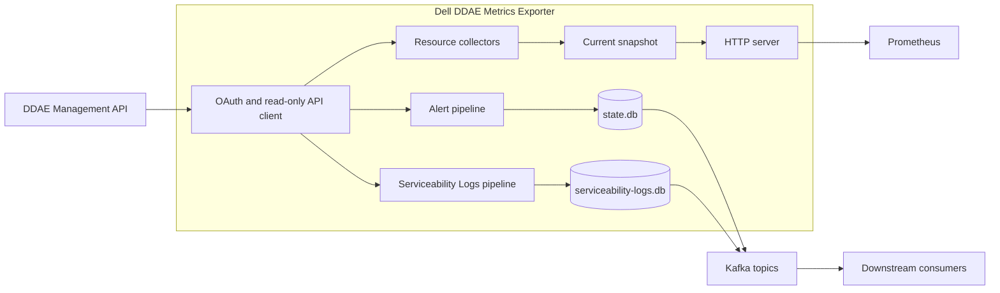

# Dell DDAE Metrics Exporter

[English](README.md) | [繁體中文](README.zh-TW.md)

Dell DDAE Metrics Exporter is a read-only Go service that collects Dell Data
Domain Active Enterprise (DDAE) 1.5.0 operational data, exposes Prometheus
metrics, and can publish serviceability records to Kafka.

It is intended for platform engineers, SRE teams, and operators who need a
small monitoring process between the DDAE Management API and their existing
Prometheus and Kafka-based observability systems.

> [!IMPORTANT]
> The implementation has deterministic local test coverage. Authenticated DDAE,
> Kafka, OpenSearch, deployment E2E, and independent release validation remain
> external gates. Local tests do not establish production compatibility.

## Overview

The exporter runs as one process for one DDAE target. It authenticates with the
fixed `dv-admin-rest` OAuth password-grant client, sends only allowlisted
monitoring requests, and serves its latest state on port `9469` by default.

Three pipelines can be enabled independently:

- **Resources** — Collects Management API availability, cluster configuration,
  node capacity and state, system lock state, and appliance readiness.
- **Alerts** — Reads serviceability issue list/detail records, stores typed
  events in a durable outbox, and publishes them to an alert Kafka topic.
- **Serviceability Logs** — Reads serviceability event list/detail records and
  publishes typed records through a separate state file and Kafka topic.

The exporter does not write to DDAE. It does not connect directly to
OpenSearch; downstream Kafka consumers own OpenSearch indexing and alerting.

## Key Features

- **Prometheus endpoint** — Exposes resource, pipeline, collection, and delivery
  metrics on `GET /metrics`.
- **Independent pipelines** — Resources, alerts, and Serviceability Logs have
  separate enable switches and collection intervals.
- **Durable Kafka delivery** — bbolt outboxes retain alert and log records until
  Kafka acknowledges them.
- **Configurable DDAE paths** — Ping and other Management API operations use
  separate path prefixes for current, RC2, and Dell PDF route layouts.
- **Strict configuration** — Accepts versioned YAML with unknown-field and type
  validation; environment variables can override YAML values.
- **TLS and Kafka authentication** — Supports custom CA bundles, Kafka mTLS,
  and Kafka PLAIN or SCRAM SASL.
- **Operations endpoints** — Provides liveness and pipeline-aware readiness
  checks.
- **Deployment profiles** — Includes a scratch container image, Kubernetes
  manifests, and a hardened systemd unit.

## Architecture



- The API client owns authentication, TLS, request limits, retries, and the
  fixed operation allowlist.
- Resource collection updates an in-memory snapshot. A Prometheus scrape never
  triggers a DDAE request.
- Alert and Serviceability Log pipelines use separate bbolt databases and Kafka
  topics so one pipeline cannot consume the other's state.
- The HTTP server exposes only metrics, liveness, and readiness endpoints.

## Technology Stack

| Layer | Technology | Purpose |
|---|---|---|
| Language and runtime | Go 1.26.6 | Exporter process and tooling |
| HTTP | Go `net/http` | Metrics and health endpoints |
| Metrics | Prometheus Go client | Prometheus/OpenMetrics output |
| Messaging | Kafka with `franz-go` | Alert and Serviceability Log delivery |
| Local state | bbolt | Durable outboxes and checkpoints |
| Configuration | YAML v3 and environment variables | Strict runtime configuration |
| Packaging | Multi-stage Docker build, scratch runtime | Non-root static container |
| Deployment | Kubernetes manifests and systemd | Container and VM deployment profiles |
| CI | GitHub Actions | Local gates and opt-in authorized integration jobs |

## Project Structure

```text
.
├── cmd/ddae-exporter/       # Process entry point
├── internal/                # Configuration, API client, pipelines, metrics, state, and HTTP server
├── integration/             # Authorized integration and deployment E2E test entry points
├── testdata/ddae-1.5.0/     # Sanitized local fixtures
├── deploy/kubernetes/       # ConfigMap, workload, Service, and default-deny NetworkPolicy
├── deploy/systemd/          # YAML example and hardened systemd unit
├── docs/runbook.md          # Operations, troubleshooting, upgrade, and recovery guide
├── scripts/                 # Build, test, security, and supply-chain stages
├── Dockerfile               # Reproducible non-root container build
└── go.mod                   # Go module and toolchain version
```

## Quick Start

This procedure builds a resources-only instance from source. It requires a
reachable DDAE target; the repository does not include a local DDAE emulator.

### Prerequisites

| Requirement | When needed |
|---|---|
| Git | Clone the repository |
| Go 1.26.6 | Build and run from source |
| DDAE 1.5.0 HTTPS origin | Every runtime mode |
| DDAE read-only username, password, and `dv-admin-rest` client secret | Every runtime mode |
| Kafka brokers and an isolated topic | Alerts or Serviceability Logs enabled |
| Writable persistent state directory | Alerts or Serviceability Logs enabled |

### Clone and build

```bash
git clone https://github.com/crispkid/Dell-DDAE-Metrics-Exporter.git
cd Dell-DDAE-Metrics-Exporter
go mod download
./scripts/build.sh
```

The binary is written to `bin/ddae-exporter`. The build script requires the
exact Go toolchain declared in `go.mod`.

### Create local credential files

Store one raw value in each file. Do not add YAML keys, quotes, or JSON.

```bash
install -d -m 0700 secrets

printf 'DDAE username: '
IFS= read -r DDAE_USERNAME_VALUE
printf 'DDAE password: '
IFS= read -r -s DDAE_PASSWORD_VALUE
printf '\nDDAE dv-admin-rest client secret: '
IFS= read -r -s DDAE_CLIENT_SECRET_VALUE
printf '\n'

printf '%s' "$DDAE_USERNAME_VALUE" > secrets/ddae-username
printf '%s' "$DDAE_PASSWORD_VALUE" > secrets/ddae-password
printf '%s' "$DDAE_CLIENT_SECRET_VALUE" > secrets/ddae-client-secret
chmod 0600 secrets/ddae-username secrets/ddae-password secrets/ddae-client-secret
unset DDAE_USERNAME_VALUE DDAE_PASSWORD_VALUE DDAE_CLIENT_SECRET_VALUE
```

Example file contents are `<DDAE_USERNAME>`, `<DDAE_PASSWORD>`, and
`<DV_ADMIN_REST_CLIENT_SECRET>` respectively. Replace the placeholders with
values supplied by the deployment's secret manager. The `secrets/` directory
is ignored by Git.

### Create a resources-only configuration

Save the following as `config.local.yaml`. Replace the DDAE origin and the three
credential paths with values for your environment. Credential paths must be
absolute.

<!-- quick-start-config:start -->
```yaml
version: 1

monitoring:
  resources:
    enabled: true
  alerts:
    enabled: false
  serviceability_logs:
    enabled: false

ddae:
  base_url: https://ddae.example.invalid
  paths:
    ping_prefix: ""
    api_prefix: /v1
  credentials:
    username_file: /absolute/path/to/secrets/ddae-username
    password_file: /absolute/path/to/secrets/ddae-password
    client_secret_file: /absolute/path/to/secrets/ddae-client-secret
```
<!-- quick-start-config:end -->

If DDAE uses a private CA, add `ddae.tls.ca_file` with the path to its PEM CA
bundle. Use the [complete YAML example](deploy/systemd/config.example.yaml) for
Kafka, state limits, logging, and advanced timeouts.

### Run and verify

```bash
./bin/ddae-exporter --config ./config.local.yaml
```

In a second terminal:

```bash
curl --fail http://127.0.0.1:9469/healthz
curl --include http://127.0.0.1:9469/readyz
curl --silent http://127.0.0.1:9469/metrics
```

`/healthz` returns `200` after the HTTP server starts. `/readyz` returns `503`
until every enabled pipeline is ready, then returns `200`. A resources-only
instance becomes ready after a successful complete DDAE collection.

## Configuration

Select YAML with `--config <path>` or `DDAE_EXPORTER_CONFIG_FILE`. Individual
environment variables override YAML values; YAML values override built-in
defaults. The loader rejects unknown keys, aliases, multiple documents,
incorrect types, invalid ranges, and files larger than 1 MiB.

### Important settings

| YAML key | Default or requirement | Purpose |
|---|---|---|
| `version` | Required: `1` | Configuration schema version |
| `monitoring.resources.enabled` | `true` | Enable Prometheus resource collection |
| `monitoring.alerts.enabled` | `true` | Enable alert collection, state, and Kafka delivery |
| `monitoring.serviceability_logs.enabled` | `false` | Enable Serviceability Log collection and delivery |
| `server.listen_address` | `127.0.0.1:9469` | Exporter HTTP listener |
| `ddae.base_url` | Required HTTPS origin | DDAE Management API origin |
| `ddae.paths.ping_prefix` | Empty | Prefix before `/ping` |
| `ddae.paths.api_prefix` | `/v1` | Prefix before other Management API suffixes |
| `ddae.credentials.*_file` | Required | Runtime files for DDAE credentials |
| `ddae.source_instance` | Required for a Kafka pipeline | Stable source identity in Kafka events |
| `kafka.brokers` | Required for a Kafka pipeline | Kafka bootstrap brokers |
| `kafka.topic` | Required for alerts | Alert topic |
| `kafka.serviceability_logs_topic` | `ddae-serviceability-logs` | Separate Serviceability Log topic |
| `state.dir` | `/var/lib/ddae-exporter` | bbolt state directory for Kafka pipelines |
| `logging.level` / `logging.format` | `info` / `json` | Application log output |

At least one monitoring pipeline must remain enabled. Resources-only mode does
not require Kafka or persistent state.

### DDAE path compatibility

`ddae.paths.ping_prefix` and `ddae.paths.api_prefix` can also be overridden by
`DDAE_PING_PATH_PREFIX` and `DDAE_API_PATH_PREFIX`.

| Route layout | `ping_prefix` | `api_prefix` | Ping request | API example |
|---|---|---|---|---|
| Default | `""` | `/v1` | `GET /ping` | `GET /v1/ddae-clusters` |
| RC2 compatibility | `/rest/v1` | `/rest/v1` | `GET /rest/v1/ping` | `GET /rest/v1/ddae-clusters` |
| Dell PDF form | `/rest` | `/rest/v1` | `GET /rest/ping` | `GET /rest/v1/ddae-clusters` |

A prefix may be empty. A non-empty prefix has a maximum length of 128 bytes,
must be a canonical ASCII absolute path prefix, and must not end with `/` or
contain empty, dot, encoded, query, fragment, authority, or control-character
forms. Prefixes are joined to fixed suffixes exactly. There is no runtime
discovery or alternate-path fallback.

### Secrets and TLS

- YAML accepts secret file paths, not plaintext DDAE passwords or client
  secrets.
- DDAE and Kafka verify certificates and hostnames by default and require TLS
  1.2 or later.
- `security.allow_insecure_tls: true` and a target-specific
  `insecure_skip_verify: true` are both required to disable verification. This
  diagnostic mode is not valid release evidence.
- Kafka supports custom CA bundles, an optional client certificate/key pair,
  and `PLAIN`, `SCRAM-SHA-256`, or `SCRAM-SHA-512` SASL.

See [the complete YAML example](deploy/systemd/config.example.yaml) for every
supported key and [the runbook](docs/runbook.md) for deployment secret handling.

## Interfaces

### Exporter HTTP endpoints

The exporter does not require application-level authentication. Keep a
non-loopback listener behind a controlled network path or an authenticated
reverse proxy.

| Method | Endpoint | Purpose |
|---|---|---|
| `GET` | `/metrics` | Prometheus/OpenMetrics output |
| `GET` | `/healthz` | Process liveness; returns `alive` |
| `GET` | `/readyz` | Readiness of all enabled pipelines |

### DDAE Management API operations

| Method | Default path or family | Used by |
|---|---|---|
| `POST` | `/auth/realms/ddae/protocol/openid-connect/token` | OAuth token acquisition |
| `GET` | `/ping` | API availability |
| `GET` | `/v1/ddae-clusters`, `/v1/infrastructure-nodes` | Cluster and node metrics |
| `GET` | `/v1/system-lock`, `/v1/system-shutdown` | Appliance status metrics |
| `GET` | `/v1/serviceability-issues[/{id}]` | Alert pipeline |
| `GET` | `/v1/serviceability-events[/{id}]` | Serviceability Logs pipeline |

The POST is limited to OAuth authentication. All monitoring operations are
read-only GET requests under the configured path prefixes.

### Prometheus metrics

Metric names use the `ddae_` prefix. Representative groups are:

| Group | Examples | Unit or value |
|---|---|---|
| Pipeline and collection | `ddae_monitoring_enabled`, `ddae_collector_success` | Boolean `0` or `1` |
| Freshness and duration | `ddae_snapshot_age_seconds`, `ddae_collector_duration_seconds` | Seconds |
| Cluster configuration | `ddae_cluster_coordinator_configured_cpu_cores`, `ddae_cluster_coordinator_configured_memory_bytes` | CPU cores and bytes |
| Node capacity | `ddae_node_capacity_cpu_cores`, `ddae_node_capacity_memory_bytes`, `ddae_node_capacity_ephemeral_storage_bytes` | CPU cores and bytes |
| Appliance status | `ddae_system_locked`, `ddae_control_plane_ready` | Boolean `0` or `1` |
| Kafka delivery | `ddae_kafka_events_published_total`, `ddae_kafka_buffered_events` | Counter and record count |
| Serviceability Logs | `ddae_serviceability_log_records_published_total`, `ddae_serviceability_log_buffered_records` | Counter and record count |

The resource values describe configuration, capacity, allocatable resources,
and state. They are not CPU, memory, or storage utilization measurements.

### Kafka output

Alerts use schema `1.0` and event type
`ddae.serviceability_alert.upsert`. Serviceability Logs use schema `1.0` and
event type `ddae.serviceability_log.upsert`. Records contain normalized,
allowlisted fields and deterministic keys; raw DDAE responses are not forwarded.

Kafka delivery uses `acks=all`. The two pipelines use separate topics and state
files. Consumers should handle a repeated key idempotently because a publish
timeout can leave broker acceptance uncertain.

## Development and Testing

Run commands from the repository root.

| Task | Command |
|---|---|
| Format check and static analysis | `./scripts/stage-lint.sh` |
| Unit and component tests with the race detector | `./scripts/stage-test.sh` |
| Coverage gate | `./scripts/stage-coverage.sh` |
| Build | `./scripts/build.sh` |
| Vulnerability policy | `./scripts/security-policy.sh` |
| SBOM and supply-chain checks | `./scripts/supply-chain.sh` |

The vulnerability stage requires `govulncheck` v1.7.0. The supply-chain stage
requires `cyclonedx-gomod` v1.10.0 and a clean committed worktree; CI installs
both pinned tools before running these stages.

Local tests use recording servers, test doubles, and sanitized fixtures; they
do not require DDAE, Kafka, or OpenSearch. The `integration` and `e2e` stages
require explicitly authorized non-production environments and are blocked when
their opt-in variables are absent.

## Deployment

### Container

Build a local image:

```bash
docker build -t ddae-exporter:dev .
```

The runtime image is `scratch`, runs as UID/GID `65532`, and listens on port
`9469`. Mount the YAML, credential files, CA files, and persistent state needed
by the enabled pipelines.

### Kubernetes

The [Kubernetes deployment](deploy/kubernetes/deployment.yaml) includes one
replica, `Recreate` strategy, non-root security settings, a Service, and a
ReadWriteOnce state volume. Before applying it:

- Replace all `.invalid` endpoints and the example image reference.
- Create the referenced credential and trust Secrets out of band.
- Review the [ConfigMap](deploy/kubernetes/configmap.yaml).
- Add site-specific ingress and egress rules. The committed
  [NetworkPolicy](deploy/kubernetes/networkpolicy.yaml) denies all traffic.

### Linux and systemd

Install the binary, copy the
[configuration example](deploy/systemd/config.example.yaml), provision the
credential files, and install the [systemd unit](deploy/systemd/ddae-exporter.service).
The unit uses systemd credentials and service hardening directives.

Follow the [operations runbook](docs/runbook.md) before deploying, upgrading,
rolling back, or recovering state.

## Observability

| Signal | Implementation |
|---|---|
| Metrics | Prometheus/OpenMetrics on `/metrics` |
| Liveness | `GET /healthz` |
| Readiness | `GET /readyz`, evaluated from enabled pipelines |
| Logs | Structured JSON by default; optional text format |

The repository does not implement distributed tracing or bundle Grafana
dashboards.

## Security

- DDAE monitoring traffic is restricted to a compiled read-only GET allowlist.
- Credentials are loaded from regular runtime files and are excluded from
  metrics and bounded error output.
- TLS verification is on by default for DDAE and Kafka.
- Kafka event fields are typed, size-bounded, and allowlisted.
- The container and Kubernetes profiles run without root or Linux capabilities.
- The Kubernetes service account token is not mounted, and the committed
  NetworkPolicy is default-deny.

## Troubleshooting

| Symptom | Check |
|---|---|
| DDAE returns `404` | Confirm `ddae.paths.ping_prefix` and `ddae.paths.api_prefix` match the deployed gateway. The exporter does not try alternate routes. |
| Authentication fails | Confirm the three DDAE credential files exist, contain one value each, and are readable by the exporter account. |
| TLS validation fails | Confirm the configured hostname matches the certificate and the correct PEM CA bundle is mounted. |
| `/readyz` returns `503` | Check enabled pipeline metrics, collector success, snapshot age, state health, and Kafka delivery status. |
| Kafka buffered count grows | Check broker reachability, TLS/SASL settings, topic ACLs, and state volume capacity. Preserve the state database. |
| State database will not open | Confirm only one exporter uses the directory and verify filesystem locks, permissions, and free space. |

See [the runbook](docs/runbook.md#troubleshooting) for recovery actions and
state-preservation rules.

## Documentation

- [Configuration example](deploy/systemd/config.example.yaml)
- [Operations runbook](docs/runbook.md)
- [Kubernetes ConfigMap](deploy/kubernetes/configmap.yaml)
- [Kubernetes deployment](deploy/kubernetes/deployment.yaml)
- [Kubernetes NetworkPolicy](deploy/kubernetes/networkpolicy.yaml)
- [systemd unit](deploy/systemd/ddae-exporter.service)
- [Traditional Chinese README](README.zh-TW.md)

## License

Licensed under the [Apache License 2.0](LICENSE).
