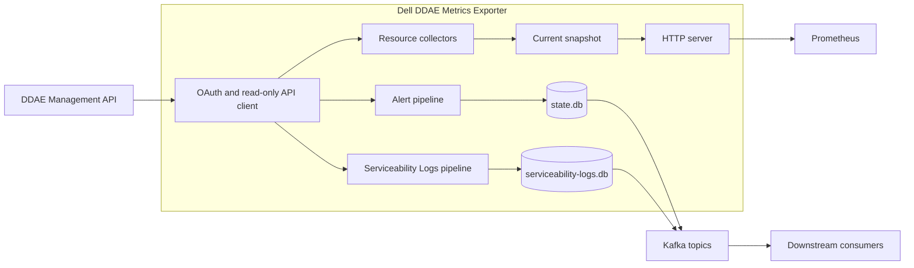

# Dell DDAE Metrics Exporter

[English](README.md) | 繁體中文

Dell DDAE Metrics Exporter 是以 Go 開發的唯讀監控服務，可從 Dell Data
Domain Active Enterprise（DDAE）1.5.0 收集維運資料、輸出 Prometheus
metrics，並將具明確型別的 serviceability records 發布至 Kafka。

## 專案概述

Exporter 以單一程序監控一個 DDAE target。它透過 `dv-admin-rest` OAuth
password-grant client 完成驗證，定期呼叫固定的 Management API allowlist，
並預設透過 port `9469` 提供最新監控狀態。

平台工程師、SRE 與維運人員可以使用本專案串接 DDAE 與既有的 Prometheus、
Kafka 監控系統。Prometheus 直接從 Exporter 取得目前的資源狀態；Kafka
consumer 則可使用 Alert 與 Serviceability Log events，建立後續 indexing 與
告警流程。

## 核心功能

- **資源監控** — 收集 API availability、cluster configuration、node state
  與 capacity、system lock state 及 appliance readiness。
- **Prometheus metrics** — 透過 `GET /metrics` 輸出 resource、collection、
  pipeline 與 Kafka delivery metrics。
- **Serviceability Alerts** — 讀取 issue list/detail，將正規化 Alert events
  發布到專用 Kafka topic。
- **Serviceability Logs** — 讀取 event list/detail，並使用獨立的 Kafka
  topic 與 state path 發布資料。
- **獨立 pipeline** — Resources、Alerts 與 Serviceability Logs 各自具備
  enable switch 與 collection interval。
- **Durable delivery** — 兩個獨立的 bbolt outbox 會保留 Kafka records，直到
  broker 完成 acknowledgement。
- **可設定的 API prefix** — Ping 與 Management API 使用不同 prefix，可對應
  default、RC2 與 Dell PDF route layouts。
- **嚴格 YAML 設定** — 使用具版本的 YAML，在服務啟動前驗證 field name、
  type、range 與 timing relationship。
- **安全傳輸** — DDAE 與 Kafka 使用 TLS 1.2 以上，並支援 custom CA、Kafka
  mTLS、PLAIN 及 SCRAM SASL。
- **部署設定** — 提供 non-root scratch container、Kubernetes manifests 與
  hardened systemd unit。

## 架構



- API client 負責 authentication、TLS、request bounds、retries 與固定的
  operation allowlist。
- Resource collector 更新記憶體內的 snapshot；Prometheus scrape 透過 HTTP
  server 讀取該 snapshot。
- Alert 與 Serviceability Log pipelines 使用不同的 bbolt databases 與 Kafka
  topics。
- Kafka consumer 負責 OpenSearch upsert 與告警發送等下游處理。

## 技術組成

| Layer | Technology | Purpose |
|---|---|---|
| Language and runtime | Go 1.26.6 | Exporter 程序與開發工具 |
| HTTP | Go `net/http` | Metrics、liveness 與 readiness endpoints |
| Metrics | Prometheus Go client | Prometheus/OpenMetrics exposition |
| Messaging | Kafka with `franz-go` | Alert 與 Serviceability Log delivery |
| Local state | bbolt | Durable outboxes 與 checkpoints |
| Configuration | YAML v3 與 Environment Variables | 嚴格的 runtime configuration |
| Resource parsing | Kubernetes apimachinery | CPU、memory 與 storage quantities |
| Packaging | Multi-stage Docker build 與 scratch runtime | Static non-root container |
| Deployment | Kubernetes manifests 與 systemd | Container 與 Linux VM profiles |
| CI/CD | GitHub Actions | Local gates 與 authorized integration jobs |

## 專案結構

```text
.
├── cmd/ddae-exporter/       # 程序進入點
├── internal/                # 設定、API client、pipelines、metrics、state 與 HTTP server
├── integration/             # Authorized integration 與 deployment E2E test entry points
├── testdata/ddae-1.5.0/     # 本機測試使用的 sanitized DDAE fixtures
├── deploy/kubernetes/       # ConfigMap、workload、Service 與 NetworkPolicy
├── deploy/systemd/          # 完整 YAML 範例與 hardened systemd unit
├── docs/runbook.md          # 維運、故障排除、升級與復原手冊
├── scripts/                 # Build、test、security 與 supply-chain stages
├── Dockerfile               # Reproducible non-root container build
└── go.mod                   # Go module、dependencies 與 toolchain version
```

## 開始使用

以下流程會從 Source Code 建立 resources-only instance。此模式透過 DDAE 與
Exporter HTTP interfaces 提供 Prometheus resource metrics。

### 前置需求

| Requirement | Version | Required for | Verification |
|---|---|---|---|
| Git | — | 取得 Source Code | `git --version` |
| Go | 指定使用 `go1.26.6` | Source build、test 與 run | `go version` |
| Bash | — | 執行專案 scripts | `bash --version` |
| curl | — | 驗證 runtime | `curl --version` |
| DDAE | System Software 1.5.0 | 所有 runtime mode | 向 DDAE 管理者確認 |
| DDAE credentials | Read-only username、password 與 `dv-admin-rest` client secret | 所有 runtime mode | 啟動前確認檔案可用 |
| Kafka | — | Alert 或 Serviceability Log pipeline | 確認 broker、topic、TLS 與 ACL |
| Docker | — | Container profile | `docker version` |
| Kubernetes CLI | 與 cluster 相容的版本 | Kubernetes profile | `kubectl version --client` |
| systemd | Linux host 提供的版本 | VM/systemd profile | `systemctl --version` |

依選擇的安裝方式準備所需工具。從 Source Code 開始的流程使用 Git、Go、
Bash、curl 與可連線的 DDAE。

### 準備 DDAE 連線資訊

向 DDAE 管理者取得下列資料：

- DDAE 1.5.0 HTTPS origin，例如 `https://ddae.example.com`。
- 與 DDAE TLS certificate 相符的固定 DNS name。
- Read-only DDAE username 與 password。
- 固定 `dv-admin-rest` OAuth client 的 client secret。
- DDAE 使用 private certificate authority 時所需的 PEM CA bundle。
- 目前 gateway 使用的 route layout。預設值是 `/ping` 與 `/v1/*`；其他
  組合請參考 [DDAE path 相容性](#ddae-path-相容性)。

呼叫設定的 Ping route，確認 DNS、TCP 與 TLS 連線：

```bash
DDAE_BASE_URL="https://<ddae-host>"
curl --silent --show-error --output /dev/null \
  --write-out 'HTTP %{http_code}\n' "${DDAE_BASE_URL}/ping"
unset DDAE_BASE_URL
```

收到 HTTP response 表示 curl 已連上 TLS endpoint。Exporter 會在啟動後執行
authenticated request。

### 準備網路連線

| Direction | Destination | Purpose |
|---|---|---|
| Outbound | DDAE HTTPS origin 與設定的 port | OAuth 與 Management API requests |
| Outbound | 設定的 Kafka broker addresses | Enabled Alert 或 Serviceability Log delivery |
| Inbound | Exporter TCP `9469`，預設值 | Prometheus、liveness 與 readiness requests |

本機使用預設的 loopback listener。Container 與 Kubernetes profiles 在各自的
隔離網路內使用 `0.0.0.0:9469`。

### Clone 與 build

```bash
git clone https://github.com/crispkid/Dell-DDAE-Metrics-Exporter.git
cd Dell-DDAE-Metrics-Exporter
go mod download
./scripts/build.sh
```

Build 完成後會產生 `bin/ddae-exporter`。確認 binary 已建立：

```bash
test -x bin/ddae-exporter
```

### 建立 runtime directories

本機流程會將 credential files 放在 Git 已排除的 `secrets/` directory。
`trust/` 可存放本機 CA bundle；啟用 Kafka pipeline 時可使用 `state/` 保存
durable state。

```bash
install -d -m 0700 secrets trust state
pwd
```

請記下 `pwd` 顯示的 absolute path；YAML 內的 credential 與 state paths 使用
absolute paths。

### 建立 DDAE credential files

每個 credential file 只包含一個原始 UTF-8 值。下列指令會避免顯示 password，
並將 file mode 設為 `0600`：

```bash
printf 'DDAE username: '
IFS= read -r DDAE_USERNAME_VALUE
printf 'DDAE password: '
IFS= read -r -s DDAE_PASSWORD_VALUE
printf '\nDDAE dv-admin-rest client secret: '
IFS= read -r -s DDAE_CLIENT_SECRET_VALUE
printf '\n'

printf '%s' "$DDAE_USERNAME_VALUE" > secrets/ddae-username
printf '%s' "$DDAE_PASSWORD_VALUE" > secrets/ddae-password
printf '%s' "$DDAE_CLIENT_SECRET_VALUE" > secrets/ddae-client-secret
chmod 0600 secrets/ddae-username secrets/ddae-password secrets/ddae-client-secret
unset DDAE_USERNAME_VALUE DDAE_PASSWORD_VALUE DDAE_CLIENT_SECRET_VALUE
```

| File | Example content |
|---|---|
| `secrets/ddae-username` | `<DDAE_USERNAME>` |
| `secrets/ddae-password` | `<DDAE_PASSWORD>` |
| `secrets/ddae-client-secret` | `<DV_ADMIN_REST_CLIENT_SECRET>` |

請使用 deployment secret manager 提供的值。Exporter 接受最大 64 KiB 的
regular credential file，並會移除檔案結尾的一組 newline sequence。

### 安裝 private CA

DDAE 使用 private CA 時，將 PEM bundle 複製到本機 trust directory：

```bash
install -m 0644 /path/from/administrator/ddae-ca.pem trust/ddae-ca.pem
```

在 YAML 的 `ddae.tls.ca_file` 設定 absolute `trust/ddae-ca.pem` path。使用
public CA 的 certificate 會由 host 既有的 root pool 驗證。

### 準備 Kafka pipelines

啟用 Alerts 或 Serviceability Logs 時完成此步驟。取得或建立：

- 一至 64 個 TLS Kafka broker addresses。
- 啟用 Alerts 時，為 `kafka.topic` 準備專用 Alert topic。
- 啟用 Serviceability Logs 時，為 `kafka.serviceability_logs_topic` 準備另一個
  獨立 topic。
- 設定 identity 與 topics 所需的 producer ACLs。
- Broker 要求的 Kafka CA bundle、optional mTLS certificate/key pair 與
  optional SASL credentials。
- 具備 file locking 與 fsync 的 writable absolute `state.dir`。
- 用於 Kafka event identity 的固定 `ddae.source_instance` 值。

Broker 使用 PLAIN 或 SCRAM 時，建立 Kafka SASL password file：

```bash
printf 'Kafka SASL password: '
IFS= read -r -s KAFKA_PASSWORD_VALUE
printf '\n'
printf '%s' "$KAFKA_PASSWORD_VALUE" > secrets/kafka-password
chmod 0600 secrets/kafka-password
unset KAFKA_PASSWORD_VALUE
```

依 [`deploy/systemd/config.example.yaml`](deploy/systemd/config.example.yaml)
設定 brokers、topics、TLS/SASL values、state directory 與 selected pipelines。
啟動後透過 `/readyz` 與 Kafka pipeline metrics 確認 collection、state 與
broker delivery readiness。

### 建立 resources-only 設定檔

將以下內容儲存為 `config.local.yaml`，並替換前述步驟取得的 origin 與
credential paths。

<!-- quick-start-config:start -->
```yaml
version: 1

monitoring:
  resources:
    enabled: true
  alerts:
    enabled: false
  serviceability_logs:
    enabled: false

server:
  listen_address: 127.0.0.1:9469

ddae:
  base_url: https://ddae.example.invalid
  paths:
    ping_prefix: ""
    api_prefix: /v1
  credentials:
    username_file: /absolute/path/to/secrets/ddae-username
    password_file: /absolute/path/to/secrets/ddae-password
    client_secret_file: /absolute/path/to/secrets/ddae-client-secret
```
<!-- quick-start-config:end -->

保護設定檔：

```bash
chmod 0600 config.local.yaml
```

完整設定範例位於
[`deploy/systemd/config.example.yaml`](deploy/systemd/config.example.yaml)。

### 啟動 Exporter

```bash
./bin/ddae-exporter --config ./config.local.yaml
```

程序會將 structured logs 寫入 standard output。完成驗證前請保持此 terminal
開啟。

### 驗證安裝結果

開啟第二個 terminal 並執行：

```bash
curl --fail --silent --show-error http://127.0.0.1:9469/healthz
curl --include http://127.0.0.1:9469/readyz
curl --silent http://127.0.0.1:9469/metrics
```

預期結果：

| Check | Successful result |
|---|---|
| `GET /healthz` | HTTP `200`，內容為 `alive` |
| `GET /readyz` | 第一次完整 DDAE collection 完成後回傳 HTTP `200` 與 `ready` |
| `GET /metrics` | Prometheus output 包含 `ddae_build_info`、`ddae_monitoring_enabled` 與 resource metrics |
| Exporter log | 顯示 `DDAE exporter started` startup message |

安裝完成後確認：

- Exporter process 持續執行。
- DDAE authentication 與 enabled resource collectors 執行成功。
- `/healthz` 與 `/readyz` 回傳 HTTP `200`。
- `/metrics` 包含目前的 resource 與 collector series。
- Credential files 僅供指定的本機 account 讀取。

## 設定參考

### 設定檔位置

| Runtime profile | Configuration | Secrets | State |
|---|---|---|---|
| Local source run | `config.local.yaml` | Absolute local file paths | Optional local absolute path |
| Container | Mounted YAML，例如 `/etc/ddae-exporter/config.yaml` | `/run/secrets` 下的 read-only mounts | Writable `/var/lib/ddae-exporter` mount |
| Kubernetes | [`deploy/kubernetes/configmap.yaml`](deploy/kubernetes/configmap.yaml) | Referenced Kubernetes Secrets | `/var/lib/ddae-exporter` 上的 ReadWriteOnce PVC |
| systemd | `/etc/ddae-exporter/config.yaml` | systemd `LoadCredential=` files | Managed `StateDirectory=ddae-exporter` |

準備完整設定時，複製 systemd 版本的範例：

```bash
cp deploy/systemd/config.example.yaml config.local.yaml
chmod 0600 config.local.yaml
```

啟動前請替換所有 `.invalid`、`replace-with-*`、credential path、CA path、
broker、topic 與 pipeline selection。

### 設定檔選擇與優先順序

YAML 使用 schema `version: 1`、UTF-8 與單一 document，file size 上限為
1 MiB。Loader 會先驗證所有設定，再開啟 HTTP listener 與啟動 workers。

設定優先順序由高至低如下：

1. 個別 Environment Variables。
2. `--config <path>` 選擇的 YAML。
3. `DDAE_EXPORTER_CONFIG_FILE` 選擇的 YAML。
4. Built-in defaults。

所有設定都在程序啟動時載入。修改 YAML、Environment Variables、credentials、
certificates、topics 或 limits 後，重新啟動 Exporter。

### Pipeline 設定

至少需啟用一條 pipeline。

| YAML key | Required | Default / accepted values | Purpose |
|---|:---:|---|---|
| `monitoring.resources.enabled` | No | `true` | 收集 DDAE resource data 並輸出 resource metrics |
| `monitoring.resources.interval` | No | `30s`，positive Go duration | Resource collection interval |
| `monitoring.resources.stale_after` | No | `120s`，大於 resource interval | Current resource snapshot 的最大 age |
| `monitoring.alerts.enabled` | No | `true` | 啟用 issue list/detail collection、Alert state 與 Kafka delivery |
| `monitoring.alerts.interval` | No | `30s`，positive Go duration | Alert list collection interval |
| `monitoring.alerts.list_response_max_bytes` | No | `8388608`，range `1–67108864` | Alert list response bytes 上限 |
| `monitoring.alerts.detail.response_max_bytes` | No | `1048576`，range `1–67108864` | 單筆 Alert detail response bytes 上限 |
| `monitoring.alerts.detail.refresh_interval` | No | `10m`，至少等於 Alert interval | 已知 Alert 的 refresh interval |
| `monitoring.alerts.detail.max_per_cycle` | No | `200`，range `1–10000` | 每個 cycle 處理的 detail records |
| `monitoring.alerts.detail.concurrency` | No | `4`，range `1–128` | Concurrent detail requests；不超過 `max_per_cycle` |
| `monitoring.serviceability_logs.enabled` | No | `false` | 啟用 Serviceability Log collection、state 與 Kafka delivery |
| `monitoring.serviceability_logs.interval` | No | `30s`，positive Go duration | Serviceability Log list collection interval |
| `monitoring.serviceability_logs.list_response_max_bytes` | No | `8388608`，range `1–67108864` | Log list response bytes 上限 |
| `monitoring.serviceability_logs.detail.response_max_bytes` | No | `1048576`，range `1–67108864` | 單筆 Log detail response bytes 上限 |
| `monitoring.serviceability_logs.detail.refresh_interval` | No | `10m`，至少等於 Log interval | 已知 Log 的 refresh interval |
| `monitoring.serviceability_logs.detail.max_per_cycle` | No | `200`，range `1–10000` | 每個 cycle 處理的 detail records |
| `monitoring.serviceability_logs.detail.concurrency` | No | `4`，range `1–128` | Concurrent detail requests；不超過 `max_per_cycle` |

Duration 使用 Go syntax，例如 `500ms`、`5s`、`10m` 與 `720h`。設定的 timing
需符合以下關係：

```text
ddae.request_timeout < ddae.cycle_timeout < each enabled pipeline interval
monitoring.resources.interval < monitoring.resources.stale_after
monitoring.alerts.detail.refresh_interval >= monitoring.alerts.interval
monitoring.serviceability_logs.detail.refresh_interval >= monitoring.serviceability_logs.interval
```

### Server、Security 與 Logging 設定

| YAML key | Required | Default / accepted values | Purpose |
|---|:---:|---|---|
| `server.listen_address` | No | `127.0.0.1:9469`，explicit `host:port`，port `1–65535` | Exporter HTTP listener |
| `server.shutdown_grace_period` | No | `15s`，positive Go duration | Graceful shutdown budget |
| `security.allow_insecure_tls` | No | `false` | Target-specific TLS diagnostic mode 的 global acknowledgement |
| `logging.level` | No | `info`；`debug`、`info`、`warn`、`error` | Minimum application log level |
| `logging.format` | No | `json`；`json` 或 `text` | Log encoding |

### DDAE 設定

| YAML key | Required | Default / accepted values | Purpose |
|---|:---:|---|---|
| `ddae.base_url` | Yes | HTTPS origin，不含 path、query、fragment 或 user information | DDAE Management API origin |
| `ddae.paths.ping_prefix` | No | Empty string | 固定 `/ping` suffix 前的 prefix |
| `ddae.paths.api_prefix` | No | `/v1` | 其他固定 API suffix 前的 prefix |
| `ddae.source_instance` | Kafka pipeline | 1–128 valid UTF-8 bytes | Kafka event 內的固定 source identity |
| `ddae.credentials.username_file` | Yes* | Readable regular file | DDAE read-only username |
| `ddae.credentials.password_file` | Yes* | Readable regular file | DDAE read-only password |
| `ddae.credentials.client_secret_file` | Yes* | Readable regular file | `dv-admin-rest` client secret |
| `ddae.tls.ca_file` | No | System roots 或 PEM CA path | 額外的 DDAE trust roots |
| `ddae.tls.insecure_skip_verify` | No | `false`；需要 global acknowledgement | Target-specific TLS diagnostic mode |
| `ddae.request_timeout` | No | `5s`，positive Go duration | 單次 token 或 API request deadline |
| `ddae.cycle_timeout` | No | `20s`，positive Go duration | 單次 collection cycle 的 aggregate deadline |
| `ddae.response_max_bytes` | No | `4194304`，range `1–67108864` | General DDAE response bytes 上限 |
| `ddae.retry_max` | No | `2`，range `0–10` | Initial safe request 後的 retry 次數 |

`Yes*` 可使用 YAML file setting 或對應的 direct secret Environment Variable。
Deployment profiles 使用 file-based values。

### DDAE path 相容性

`ddae.paths.ping_prefix` 與 `ddae.paths.api_prefix` 也可由
`DDAE_PING_PATH_PREFIX` 與 `DDAE_API_PATH_PREFIX` 覆寫。

| Route layout | `ping_prefix` | `api_prefix` | Ping request | API example |
|---|---|---|---|---|
| Default | `""` | `/v1` | `GET /ping` | `GET /v1/ddae-clusters` |
| RC2 compatibility | `/rest/v1` | `/rest/v1` | `GET /rest/v1/ping` | `GET /rest/v1/ddae-clusters` |
| Dell PDF form | `/rest` | `/rest/v1` | `GET /rest/ping` | `GET /rest/v1/ddae-clusters` |

Prefix 可以是 empty。Non-empty prefix 的最大長度是 128 bytes，並使用
canonical ASCII absolute path：以一個 slash 開頭、不以 slash 結尾，segment
只能包含英文字母、數字、`.`、`_`、`~` 或 `-`。Route selection 採固定方式；
每個 operation 只會組合設定的 prefix 與固定 suffix，不使用 runtime discovery
或 alternate-path fallback。

### Kafka 設定

啟用 Alert 或 Serviceability Logs 時需要 Kafka 設定。

| YAML key | Required | Default / accepted values | Purpose |
|---|:---:|---|---|
| `kafka.brokers` | Kafka pipeline | 1–64 broker addresses | Kafka bootstrap brokers |
| `kafka.topic` | Alerts | 最大 249 bytes | 專用 Alert topic |
| `kafka.serviceability_logs_topic` | No | `ddae-serviceability-logs`，最大 249 bytes | 專用 Log topic；與 Alert topic 不同 |
| `kafka.client_id` | No | `ddae-exporter`，1–128 bytes | Kafka client identity |
| `kafka.tls.ca_file` | No | System roots 或 PEM CA path | 額外的 Kafka trust roots |
| `kafka.tls.client_cert_file` | mTLS | PEM certificate path | Kafka client certificate |
| `kafka.tls.client_key_file` | mTLS | PEM private-key path | 與 client certificate 配對的 key |
| `kafka.tls.insecure_skip_verify` | No | `false`；需要 global acknowledgement | Target-specific TLS diagnostic mode |
| `kafka.sasl.mechanism` | No | Empty、`PLAIN`、`SCRAM-SHA-256`、`SCRAM-SHA-512` | Kafka SASL mechanism |
| `kafka.sasl.username` | SASL | Non-empty string | Kafka SASL identity |
| `kafka.sasl.password_file` | SASL | Readable regular file | Kafka SASL password |
| `kafka.publish_timeout` | No | `10s`，minimum `1s` | Hard broker acknowledgement deadline |

Producer 使用 TLS、`acks=all`、idempotent production settings、per-key ordering
與 bounded in-memory buffering。

### State 設定

Kafka pipeline 第一次啟動時，Exporter 會自動建立 bbolt database 與 schema
metadata。Alerts 使用 `state.db`，Serviceability Logs 使用
`serviceability-logs.db`。每個 state directory 由單一 Exporter writer 使用。

| YAML key | Required | Default / accepted values | Purpose |
|---|:---:|---|---|
| `state.dir` | No | `/var/lib/ddae-exporter`，writable absolute path | 兩個 state databases 所在 directory |
| `state.outbox_max_bytes` | No | `1073741824`，positive bytes | Alert outbox bytes 上限 |
| `state.outbox_max_events` | No | `100000`，range `1–10000000` | Alert outbox records 上限 |
| `state.checkpoint_retention` | No | `720h`，positive Go duration | Alert 離開 complete list 後的 retention |
| `state.checkpoint_max_alerts` | No | `100000`，range `1–10000000` | Alert checkpoint 上限 |
| `state.serviceability_logs_outbox_max_bytes` | No | `1073741824`，positive bytes | Log outbox bytes 上限 |
| `state.serviceability_logs_outbox_max_events` | No | `100000`，range `1–10000000` | Log outbox records 上限 |
| `state.serviceability_logs_checkpoint_retention` | No | `720h`，positive Go duration | Log 離開 complete list 後的 retention |
| `state.serviceability_logs_checkpoint_max_records` | No | `100000`，range `1–10000000` | Log checkpoint 上限 |

使用具備 file locking 與 fsync 的 local 或 ReadWriteOnce filesystem，並為
enabled outbox limits 與 database overhead 保留容量。

### Secret files 與 TLS

- DDAE credentials 與 optional Kafka SASL password 使用 regular runtime files，
  每個檔案只包含一個 UTF-8 值。
- File mode `0600` 與僅供 Exporter account 存取的 parent directory，可作為
  適當的本機 permission baseline。
- DDAE 與 Kafka 會以 TLS 1.2 以上驗證 certificate 與 hostname。
- Custom CA files 會加入 system trust pool。
- Kafka mTLS 使用成對的 client certificate 與 private key。
- TLS diagnostic mode 需要同時設定 `security.allow_insecure_tls: true` 與所選
  target 的 `insecure_skip_verify: true`。

### Environment Variables

Environment Variables 提供完整的 environment-only interface，並覆寫對應的
YAML。Secret 的 deployment interface 使用 file-based values。

| Group | Environment variables |
|---|---|
| Configuration selector | `DDAE_EXPORTER_CONFIG_FILE` |
| Pipeline switches | `DDAE_RESOURCE_MONITORING_ENABLED`, `DDAE_ALERT_MONITORING_ENABLED`, `DDAE_SERVICEABILITY_LOG_MONITORING_ENABLED` |
| Pipeline intervals | `DDAE_COLLECTION_INTERVAL`, `DDAE_RESOURCE_COLLECTION_INTERVAL`, `DDAE_ALERT_COLLECTION_INTERVAL`, `DDAE_SERVICEABILITY_LOG_COLLECTION_INTERVAL`, `DDAE_STALE_AFTER` |
| Alert limits | `ALERT_LIST_RESPONSE_MAX_BYTES`, `ALERT_DETAIL_RESPONSE_MAX_BYTES`, `ALERT_DETAIL_REFRESH_INTERVAL`, `ALERT_DETAIL_MAX_PER_CYCLE`, `ALERT_DETAIL_CONCURRENCY` |
| Log limits | `SERVICEABILITY_LOG_LIST_RESPONSE_MAX_BYTES`, `SERVICEABILITY_LOG_DETAIL_RESPONSE_MAX_BYTES`, `SERVICEABILITY_LOG_DETAIL_REFRESH_INTERVAL`, `SERVICEABILITY_LOG_DETAIL_MAX_PER_CYCLE`, `SERVICEABILITY_LOG_DETAIL_CONCURRENCY` |
| DDAE | `DDAE_BASE_URL`, `DDAE_PING_PATH_PREFIX`, `DDAE_API_PATH_PREFIX`, `DDAE_SOURCE_INSTANCE`, `DDAE_CA_FILE`, `DDAE_TLS_INSECURE_SKIP_VERIFY`, `DDAE_REQUEST_TIMEOUT`, `DDAE_CYCLE_TIMEOUT`, `DDAE_RESPONSE_MAX_BYTES`, `DDAE_RETRY_MAX` |
| DDAE credentials | `DDAE_USERNAME`, `DDAE_PASSWORD`, `DDAE_CLIENT_SECRET`, `DDAE_USERNAME_FILE`, `DDAE_PASSWORD_FILE`, `DDAE_CLIENT_SECRET_FILE` |
| Kafka | `KAFKA_BROKERS`, `KAFKA_TOPIC`, `KAFKA_SERVICEABILITY_LOG_TOPIC`, `KAFKA_CLIENT_ID`, `KAFKA_PUBLISH_TIMEOUT` |
| Kafka TLS | `KAFKA_CA_FILE`, `KAFKA_CLIENT_CERT_FILE`, `KAFKA_CLIENT_KEY_FILE`, `KAFKA_TLS_INSECURE_SKIP_VERIFY` |
| Kafka SASL | `KAFKA_SASL_MECHANISM`, `KAFKA_SASL_USERNAME`, `KAFKA_SASL_PASSWORD`, `KAFKA_SASL_PASSWORD_FILE` |
| State | `STATE_DIR`, `KAFKA_OUTBOX_MAX_BYTES`, `KAFKA_OUTBOX_MAX_EVENTS`, `CHECKPOINT_RETENTION`, `CHECKPOINT_MAX_ALERTS` |
| Log state | `SERVICEABILITY_LOG_OUTBOX_MAX_BYTES`, `SERVICEABILITY_LOG_OUTBOX_MAX_EVENTS`, `SERVICEABILITY_LOG_CHECKPOINT_RETENTION`, `SERVICEABILITY_LOG_CHECKPOINT_MAX_RECORDS` |
| Server and logging | `EXPORTER_LISTEN_ADDRESS`, `SHUTDOWN_GRACE_PERIOD`, `LOG_LEVEL`, `LOG_FORMAT` |
| TLS acknowledgement | `ALLOW_INSECURE_TLS` |

Direct secret Environment Variables 與對應的 `*_FILE` variable 是 mutually
exclusive。`DDAE_COLLECTION_INTERVAL` 是 legacy shared alias；resource-specific
與 alert-specific interval variables 具有較高優先順序。

## 使用方式與介面

### Exporter HTTP endpoints

| Method | Endpoint | Purpose | Successful response |
|---|---|---|---|
| `GET` | `/metrics` | Prometheus/OpenMetrics output | HTTP `200` 與 metric exposition |
| `GET` | `/healthz` | Process liveness | HTTP `200` 與 `alive` |
| `GET` | `/readyz` | 所有 enabled pipelines 的 readiness | HTTP `200` 與 `ready` |

Non-loopback listener 應放在受控 network path，或具 authentication 的 reverse
proxy、service mesh 後方。

### DDAE Management API operations

| Method | Default path | Purpose |
|---|---|---|
| `POST` | `/auth/realms/ddae/protocol/openid-connect/token` | 取得 `dv-admin-rest` client 的 bearer token |
| `GET` | `/ping` | Management API availability |
| `GET` | `/v1/ddae-clusters` | Cluster state 與 Coordinator/Worker configuration |
| `GET` | `/v1/infrastructure-nodes` | Node state、capacity、allocatable resources 與 conditions |
| `GET` | `/v1/system-lock` | Appliance lock state |
| `GET` | `/v1/system-shutdown` | Control-plane 與 node readiness |
| `GET` | `/v1/serviceability-issues` | Alert identifiers |
| `GET` | `/v1/serviceability-issues/{id}` | 單筆 validated Alert detail record |
| `GET` | `/v1/serviceability-events` | Serviceability Log identifiers |
| `GET` | `/v1/serviceability-events/{id}` | 單筆 validated Serviceability Log detail record |

OAuth 使用固定的 authentication POST。Monitoring 使用設定 prefix 下的九個
read-only GET operations。

### Prometheus metrics

Metric name 使用 `ddae_` prefix。

| Unit | Representation |
|---|---|
| Boolean | `0` 或 `1` |
| One-hot state | 固定 state set 中一條 series 為 `1`，其餘為 `0` |
| Duration 與 age | Seconds，可包含小數 |
| Memory 與 storage | Bytes |
| CPU | CPU cores，可包含小數 |
| Counts | Non-negative records、nodes、alerts、events 或 logs |
| Counters | 單一 process lifetime 內持續增加的 non-negative values |

| Group | Representative metrics |
|---|---|
| Build 與 pipeline state | `ddae_build_info`, `ddae_monitoring_enabled` |
| Collection | `ddae_collector_success`, `ddae_collector_duration_seconds` |
| Resource freshness | `ddae_up`, `ddae_snapshot_age_seconds`, `ddae_management_api_up` |
| Cluster configuration | `ddae_cluster_coordinator_configured_cpu_cores`, `ddae_cluster_coordinator_configured_memory_bytes` |
| Node capacity | `ddae_node_capacity_cpu_cores`, `ddae_node_capacity_memory_bytes`, `ddae_node_capacity_ephemeral_storage_bytes` |
| Appliance readiness | `ddae_system_locked`, `ddae_control_plane_ready`, `ddae_nodes_ready`, `ddae_nodes_total` |
| Alert delivery | `ddae_alert_pipeline_ready`, `ddae_kafka_events_published_total`, `ddae_kafka_buffered_events` |
| Log delivery | `ddae_serviceability_log_pipeline_ready`, `ddae_serviceability_log_records_published_total`, `ddae_serviceability_log_buffered_records` |

CPU、memory 與 storage series 表示 DDAE 回傳的 configured、capacity 與
allocatable values。

### Kafka events

Alerts 使用 schema `1.0` 與 event type
`ddae.serviceability_alert.upsert`。Serviceability Logs 使用 schema `1.0` 與
event type `ddae.serviceability_log.upsert`。兩種 record 都包含 normalized、
bounded fields 與 deterministic keys。

Alert value 範例：

```json
{
  "schema_version": "1.0",
  "event_type": "ddae.serviceability_alert.upsert",
  "source_system": "dell_ddae",
  "source_instance": "<stable-ddae-name>",
  "alert_id": "<alert-id>",
  "content_hash_sha256": "<64-character-lowercase-sha256>",
  "observed_at": "2026-01-01T00:00:00Z",
  "alert": {
    "severity": "warning",
    "acknowledged": false,
    "occurrence_count": 1,
    "message": "<normalized-alert-message>",
    "reason": "<normalized-alert-reason>",
    "remedies": ["<recommended-action>"]
  }
}
```

Kafka record headers 包含 `content-type: application/json` 與
`ddae-schema-version: 1.0`。Serviceability Log record 另包含
`ddae-record-kind: serviceability_log`。Consumer 以 record key 執行 idempotent
upsert，即可安全處理重複的 at-least-once delivery。

## 開發

所有專案指令都從 Repository root 執行。

| Task | Command | Result |
|---|---|---|
| 下載 dependencies | `go mod download` | 寫入 Go module cache |
| Format check 與 static analysis | `./scripts/stage-lint.sh` | 執行 `gofmt` check 與 `go vet` |
| Unit 與 component tests | `./scripts/stage-test.sh` | 執行 `go test -race ./...` |
| Coverage gate | `./scripts/stage-coverage.sh` | 建立 `coverage/coverage.out` 並套用 80% gate |
| Build | `./scripts/build.sh` | 建立 `bin/ddae-exporter` |
| Reproducible build check | `./scripts/reproducible-build.sh` | Build 兩次並比較 output |
| CI policy | `./scripts/stage-ci-policy.sh` | 驗證 committed GitHub Actions policy |
| Security policy | `./scripts/security-policy.sh` | 驗證 security contracts 並執行 `govulncheck` |
| Supply chain | `./scripts/supply-chain.sh` | 驗證 modules、build reproducibility 與 CycloneDX SBOM generation |

安裝 security 與 supply-chain stages 使用的 pinned tools：

```bash
go install golang.org/x/vuln/cmd/govulncheck@v1.7.0
go install github.com/CycloneDX/cyclonedx-gomod/cmd/cyclonedx-gomod@v1.10.0
```

Local unit 與 component suite 使用 recording HTTP servers、test doubles 與
sanitized fixtures。Authorized non-production runner 透過 [Runbook](docs/runbook.md#verification-status)
說明的 opt-in GitHub Actions workflow 執行 integration 與 deployment E2E
stages。

Supply-chain stage 從 clean committed worktree 執行，讓 checksum 與
provenance 對應到同一個 source revision。

## 建置

透過 Environment Variables 提供 build metadata：

```bash
VERSION="<version>" \
REVISION="<git-revision>" \
BUILD_DATE="<UTC-RFC3339-timestamp>" \
./scripts/build.sh
```

Build 使用 `CGO_ENABLED=0`、`-trimpath` 與 `go.mod` 指定的 Go toolchain。

## 部署

### Container

建立 image：

```bash
docker build -t ddae-exporter:dev .
```

複製已驗證的本機設定，再修改 listener 與 mount paths：

```bash
cp config.local.yaml config.container.yaml
```

在 `config.container.yaml` 使用以下值：

```yaml
server:
  listen_address: 0.0.0.0:9469
ddae:
  credentials:
    username_file: /run/secrets/ddae-username
    password_file: /run/secrets/ddae-password
    client_secret_file: /run/secrets/ddae-client-secret
state:
  dir: /var/lib/ddae-exporter
```

準備 image UID/GID `65532` 可讀寫的 mounts。以下 Linux 範例會將本機 DDAE
credentials 複製到 Container 專用 directory：

```bash
sudo install -d -m 0700 -o 65532 -g 65532 \
  secrets/container trust/container state/container
sudo install -m 0400 -o 65532 -g 65532 \
  secrets/ddae-username secrets/container/ddae-username
sudo install -m 0400 -o 65532 -g 65532 \
  secrets/ddae-password secrets/container/ddae-password
sudo install -m 0400 -o 65532 -g 65532 \
  secrets/ddae-client-secret secrets/container/ddae-client-secret
```

將設定使用的 CA bundle 複製到 `trust/container`，並提供 UID `65532` read
access。

啟動 Container：

```bash
docker run --rm \
  --name ddae-exporter \
  --read-only \
  --user 65532:65532 \
  --publish 127.0.0.1:9469:9469 \
  --mount type=bind,source="$(pwd)/config.container.yaml",target=/etc/ddae-exporter/config.yaml,readonly \
  --mount type=bind,source="$(pwd)/secrets/container",target=/run/secrets,readonly \
  --mount type=bind,source="$(pwd)/trust/container",target=/run/trust,readonly \
  --mount type=bind,source="$(pwd)/state/container",target=/var/lib/ddae-exporter \
  ddae-exporter:dev --config /etc/ddae-exporter/config.yaml
```

Scratch runtime 會以 UID/GID `65532` 執行並 expose port `9469`。

### Kubernetes

Kubernetes profile 提供 ServiceAccount、ReadWriteOnce PVC、single-replica
`Recreate` Deployment、ClusterIP Service 與 default-deny NetworkPolicy。

準備 deployment profile：

1. 更新 [`deploy/kubernetes/configmap.yaml`](deploy/kubernetes/configmap.yaml)
   內的 DDAE、Kafka、path-prefix 與 pipeline values。
2. 在 [`deploy/kubernetes/deployment.yaml`](deploy/kubernetes/deployment.yaml)
   將 example image 替換為 approved immutable image digest。
3. 建立 Deployment 引用的 `ddae-exporter-credentials`、
   `ddae-exporter-kafka` 與 `ddae-exporter-trust` Secrets。
4. 搭配 committed default-deny
   [`NetworkPolicy`](deploy/kubernetes/networkpolicy.yaml)，加入 site-specific
   DNS、DDAE、Kafka 與 Prometheus rules。
5. 將 ConfigMap、site policies、NetworkPolicy 與 Deployment 套用到 authorized
   namespace。

使用 site-specific namespace 與 source paths 建立 Secrets：

```bash
NAMESPACE="<namespace>"
kubectl create namespace "$NAMESPACE"
kubectl -n "$NAMESPACE" create secret generic ddae-exporter-credentials \
  --from-file=username=/path/to/ddae-username \
  --from-file=password=/path/to/ddae-password \
  --from-file=client-secret=/path/to/ddae-client-secret
kubectl -n "$NAMESPACE" create secret generic ddae-exporter-kafka \
  --from-file=password=/path/to/kafka-password
kubectl -n "$NAMESPACE" create secret generic ddae-exporter-trust \
  --from-file=ddae-ca.pem=/path/to/ddae-ca.pem \
  --from-file=kafka-ca.pem=/path/to/kafka-ca.pem
```

套用準備完成的 resources：

```bash
NAMESPACE="<namespace>"
SITE_POLICY_FILE="/path/to/ddae-exporter-allow-policy.yaml"
kubectl -n "$NAMESPACE" apply -f deploy/kubernetes/configmap.yaml
kubectl -n "$NAMESPACE" apply -f "$SITE_POLICY_FILE"
kubectl -n "$NAMESPACE" apply -f deploy/kubernetes/networkpolicy.yaml
kubectl -n "$NAMESPACE" apply -f deploy/kubernetes/deployment.yaml
```

確認 rollout：

```bash
NAMESPACE="<namespace>"
kubectl -n "$NAMESPACE" get deployment ddae-exporter
kubectl -n "$NAMESPACE" get pods -l app.kubernetes.io/name=ddae-exporter
kubectl -n "$NAMESPACE" get service ddae-exporter
kubectl -n "$NAMESPACE" get pvc ddae-exporter-state
kubectl -n "$NAMESPACE" rollout status deployment/ddae-exporter
kubectl -n "$NAMESPACE" logs deployment/ddae-exporter
```

### Linux 與 systemd

Systemd profile 使用專用 `ddae-exporter` account 執行，透過
`LoadCredential=` 載入 credentials，建立 `/var/lib/ddae-exporter`，並套用
service hardening directives。

安裝 binary、configuration 與 unit：

```bash
sudo useradd --system \
  --home-dir /var/lib/ddae-exporter \
  --shell /usr/sbin/nologin \
  ddae-exporter
sudo install -o root -g root -m 0755 bin/ddae-exporter /usr/local/bin/ddae-exporter
sudo install -d -o root -g ddae-exporter -m 0750 /etc/ddae-exporter
sudo install -d -o root -g root -m 0700 /etc/ddae-exporter/secrets
sudo install -d -o root -g root -m 0755 /etc/ddae-exporter/trust
sudo install -o root -g ddae-exporter -m 0640 \
  deploy/systemd/config.example.yaml /etc/ddae-exporter/config.yaml
sudo install -o root -g root -m 0644 \
  deploy/systemd/ddae-exporter.service /etc/systemd/system/ddae-exporter.service
```

安裝 unit 指定的 credential source files：

```bash
sudo install -o root -g root -m 0600 /path/to/ddae-username \
  /etc/ddae-exporter/secrets/ddae-username
sudo install -o root -g root -m 0600 /path/to/ddae-password \
  /etc/ddae-exporter/secrets/ddae-password
sudo install -o root -g root -m 0600 /path/to/ddae-client-secret \
  /etc/ddae-exporter/secrets/ddae-client-secret
sudo install -o root -g root -m 0600 /path/to/kafka-password \
  /etc/ddae-exporter/secrets/kafka-password
```

更新 `/etc/ddae-exporter/config.yaml`，將設定的 CA bundles 安裝到
`/etc/ddae-exporter/trust/`，再啟動 service：

```bash
sudo systemctl daemon-reload
sudo systemctl enable --now ddae-exporter
sudo systemctl status ddae-exporter
```

正式環境準備、state backup、upgrade、rollback 與 recovery 請依照
[維運手冊](docs/runbook.md)執行。

## 可觀測性

| Signal | Interface | Operational use |
|---|---|---|
| Metrics | `GET /metrics` | Prometheus resource 與 pipeline monitoring |
| Liveness | `GET /healthz` | Process health check |
| Readiness | `GET /readyz` | Enabled-pipeline readiness check |
| Logs | Standard output，預設 JSON | Structured component 與 bounded failure-class diagnostics |

Default local listener 的 Prometheus scrape configuration 範例：

```yaml
scrape_configs:
  - job_name: dell-ddae
    scrape_interval: 30s
    static_configs:
      - targets: ["127.0.0.1:9469"]
```

## 安全性

- DDAE monitoring traffic 限制在 compiled read-only GET allowlist。
- Credentials 從 runtime files 載入，並排除於 metrics 與 bounded error output。
- DDAE 與 Kafka 預設啟用 TLS certificate 與 hostname verification。
- Kafka event fields 具有 type、size 與 allowlist 限制。
- Container 與 Kubernetes profiles 以 non-root 執行，不使用 Linux
  capabilities。
- Kubernetes service account token 已停用；committed NetworkPolicy 從
  default-deny ingress 與 egress 開始設定。
- Systemd profile 使用 `LoadCredential=`、`NoNewPrivileges=yes`、strict
  filesystem view 與 private state directory。

## 故障排除

### 檢查 Configuration validation

以前景模式執行 Exporter，讀取 bounded configuration error：

```bash
./bin/ddae-exporter --config ./config.local.yaml
```

確認 YAML schema version `1`、field names、value types、absolute secret 與
state paths、timing relationships，以及至少一條 enabled pipeline。

### 診斷 DDAE HTTP 404

比較 gateway route layout 與 `ddae.paths.ping_prefix`、
`ddae.paths.api_prefix`。從 [DDAE path 相容性](#ddae-path-相容性) 選擇對應
設定後重新啟動。

### 診斷 Authentication

確認 credential files 存在、各自只含一個值，且 Exporter account 可讀取：

```bash
ls -l secrets/ddae-username secrets/ddae-password secrets/ddae-client-secret
```

### 診斷 TLS validation

確認 DDAE hostname 與 certificate 相符，並驗證 CA bundle：

```bash
DDAE_BASE_URL="https://<ddae-host>"
curl --cacert trust/ddae-ca.pem \
  --silent --show-error --output /dev/null \
  --write-out 'HTTP %{http_code}\n' "${DDAE_BASE_URL}/ping"
unset DDAE_BASE_URL
```

### 診斷 HTTP 503 readiness

檢查 enabled pipeline 與 collector metrics：

```bash
curl --silent http://127.0.0.1:9469/metrics | \
  grep -E 'ddae_(monitoring_enabled|collector_success|snapshot_age_seconds|alert_pipeline_ready|serviceability_log_pipeline_ready|kafka_buffered_events)'
```

### 處理 port 9469 衝突

找出目前 listener，再於 `server.listen_address` 選擇另一組 explicit
`host:port`：

```bash
lsof -nP -iTCP:9469 -sTCP:LISTEN
```

### 復原 Kafka delivery

檢查 broker reachability、TLS/SASL configuration、topic ACL 與 state volume
capacity。復原 delivery path 時保留 `state.db` 與 `serviceability-logs.db`。

### 檢查 Kubernetes readiness

```bash
NAMESPACE="<namespace>"
kubectl -n "$NAMESPACE" get pods -l app.kubernetes.io/name=ddae-exporter
kubectl -n "$NAMESPACE" describe deployment ddae-exporter
kubectl -n "$NAMESPACE" logs deployment/ddae-exporter
```

### 檢查 systemd readiness

```bash
sudo systemctl status ddae-exporter
sudo journalctl -u ddae-exporter --no-pager
```

[Runbook troubleshooting table](docs/runbook.md#troubleshooting) 提供 recovery
steps 與 state-preservation rules。

## 文件

- [完整設定範例](deploy/systemd/config.example.yaml)
- [維運手冊](docs/runbook.md)
- [Kubernetes ConfigMap](deploy/kubernetes/configmap.yaml)
- [Kubernetes Deployment and Service](deploy/kubernetes/deployment.yaml)
- [Kubernetes NetworkPolicy](deploy/kubernetes/networkpolicy.yaml)
- [systemd unit](deploy/systemd/ddae-exporter.service)
- [English README](README.md)

## 授權

本專案採用 [Apache License 2.0](LICENSE)。
