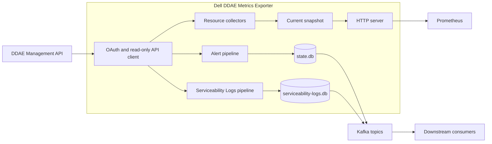

# Dell DDAE Metrics Exporter

[English](README.md) | [繁體中文](README.zh-TW.md)

Dell DDAE Metrics Exporter 是以 Go 開發的唯讀監控服務。它從 Dell Data
Domain Active Enterprise（DDAE）1.5.0 收集維運資料、輸出 Prometheus
metrics，並可將 serviceability records 發布至 Kafka。

本專案適合平台工程師、SRE 與維運人員使用，部署在 DDAE Management API
與既有 Prometheus、Kafka 監控系統之間。

> [!IMPORTANT]
> 目前實作已有可重現的本機測試。Authenticated DDAE、Kafka、OpenSearch、
> 部署 E2E 與獨立 release review 仍屬外部驗證項目；本機測試不能代表正式
> 環境相容性。

## 專案概述

Exporter 以單一程序監控一個 DDAE target。它使用固定的 `dv-admin-rest`
OAuth password-grant client 進行驗證，只執行 allowlist 內的監控操作，並預設
在 `9469` port 提供目前狀態。

三條 pipeline 可以分別啟用：

- **Resources** — 收集 Management API availability、cluster configuration、
  node capacity 與 state、system lock state 及 appliance readiness。
- **Alerts** — 讀取 serviceability issue list/detail，將 typed events 寫入
  durable outbox，再發布到 alert Kafka topic。
- **Serviceability Logs** — 讀取 serviceability event list/detail，使用獨立
  state file 與 Kafka topic 發布 typed records。

Exporter 不會修改 DDAE，也不會直接連線 OpenSearch。OpenSearch indexing 與
alerting 由下游 Kafka consumer 負責。

## 主要功能

- **Prometheus endpoint** — 透過 `GET /metrics` 輸出 resource、pipeline、
  collection 與 delivery metrics。
- **獨立 pipeline** — Resources、Alerts 與 Serviceability Logs 各有 enable
  switch 與 collection interval。
- **Durable Kafka delivery** — Alert 與 Log records 在 Kafka 確認前保留於
  bbolt outbox。
- **可設定 DDAE paths** — Ping 與其他 Management API 操作使用不同 prefix，
  可對應目前、RC2 與 Dell PDF route layouts。
- **嚴格設定檔** — 使用有版本的 YAML，檢查 unknown fields 與資料型別，並
  允許 environment variables 覆寫 YAML。
- **TLS 與 Kafka authentication** — 支援 custom CA、Kafka mTLS、PLAIN 與
  SCRAM SASL。
- **維運 endpoints** — 提供 liveness 與依 pipeline 狀態判斷的 readiness。
- **部署方式** — 提供 scratch container、Kubernetes manifests 與強化過的
  systemd unit。

## 架構



- API client 負責 authentication、TLS、request limits、retries 與固定的
  operation allowlist。
- Resource collection 更新記憶體內的 snapshot；Prometheus scrape 不會觸發
  DDAE request。
- Alert 與 Serviceability Log pipelines 使用不同的 bbolt databases 與 Kafka
  topics，不會共用彼此的 state。
- HTTP server 只提供 metrics、liveness 與 readiness endpoints。

## 技術組成

| Layer | Technology | Purpose |
|---|---|---|
| Language and runtime | Go 1.26.6 | Exporter process 與開發工具 |
| HTTP | Go `net/http` | Metrics 與 health endpoints |
| Metrics | Prometheus Go client | Prometheus/OpenMetrics output |
| Messaging | Kafka with `franz-go` | Alert 與 Serviceability Log delivery |
| Local state | bbolt | Durable outboxes 與 checkpoints |
| Configuration | YAML v3 與 environment variables | 嚴格的 runtime configuration |
| Packaging | Multi-stage Docker build、scratch runtime | Non-root static container |
| Deployment | Kubernetes manifests 與 systemd | Container 與 VM deployment profiles |
| CI | GitHub Actions | Local gates 與 opt-in authorized integration jobs |

## 專案結構

```text
.
├── cmd/ddae-exporter/       # 程序進入點
├── internal/                # 設定、API client、pipelines、metrics、state 與 HTTP server
├── integration/             # Authorized integration 與 deployment E2E test entry points
├── testdata/ddae-1.5.0/     # Sanitized local fixtures
├── deploy/kubernetes/       # ConfigMap、workload、Service 與 default-deny NetworkPolicy
├── deploy/systemd/          # YAML example 與 hardened systemd unit
├── docs/runbook.md          # 維運、故障排除、升級與復原
├── scripts/                 # Build、test、security 與 supply-chain stages
├── Dockerfile               # Reproducible non-root container build
└── go.mod                   # Go module 與 toolchain version
```

## 快速開始

以下步驟會從原始碼建立 resources-only instance。執行時需要可連線的 DDAE
target；Repository 未提供本機 DDAE emulator。

### 前置需求

| Requirement | When needed |
|---|---|
| Git | Clone Repository |
| Go 1.26.6 | 從原始碼 build 與 run |
| DDAE 1.5.0 HTTPS origin | 所有 runtime modes |
| DDAE read-only username、password 與 `dv-admin-rest` client secret | 所有 runtime modes |
| Kafka brokers 與 isolated topic | 啟用 Alerts 或 Serviceability Logs |
| Writable persistent state directory | 啟用 Alerts 或 Serviceability Logs |

### Clone 與 build

```bash
git clone https://github.com/crispkid/Dell-DDAE-Metrics-Exporter.git
cd Dell-DDAE-Metrics-Exporter
go mod download
./scripts/build.sh
```

Binary 會建立在 `bin/ddae-exporter`。Build script 要求使用 `go.mod` 指定的
Go toolchain。

### 建立本機 credential files

每個檔案只放一個原始值，不要加入 YAML key、引號或 JSON。

```bash
install -d -m 0700 secrets

printf 'DDAE username: '
IFS= read -r DDAE_USERNAME_VALUE
printf 'DDAE password: '
IFS= read -r -s DDAE_PASSWORD_VALUE
printf '\nDDAE dv-admin-rest client secret: '
IFS= read -r -s DDAE_CLIENT_SECRET_VALUE
printf '\n'

printf '%s' "$DDAE_USERNAME_VALUE" > secrets/ddae-username
printf '%s' "$DDAE_PASSWORD_VALUE" > secrets/ddae-password
printf '%s' "$DDAE_CLIENT_SECRET_VALUE" > secrets/ddae-client-secret
chmod 0600 secrets/ddae-username secrets/ddae-password secrets/ddae-client-secret
unset DDAE_USERNAME_VALUE DDAE_PASSWORD_VALUE DDAE_CLIENT_SECRET_VALUE
```

三個檔案的範例內容依序為 `<DDAE_USERNAME>`、`<DDAE_PASSWORD>` 與
`<DV_ADMIN_REST_CLIENT_SECRET>`。請替換為部署環境的 secret manager 提供的
值。`secrets/` directory 已由 Git 排除。

### 建立 resources-only 設定檔

將以下內容儲存為 `config.local.yaml`，並替換 DDAE origin 與三個 credential
paths。Credential paths 必須是 absolute paths。

<!-- quick-start-config:start -->
```yaml
version: 1

monitoring:
  resources:
    enabled: true
  alerts:
    enabled: false
  serviceability_logs:
    enabled: false

ddae:
  base_url: https://ddae.example.invalid
  paths:
    ping_prefix: ""
    api_prefix: /v1
  credentials:
    username_file: /absolute/path/to/secrets/ddae-username
    password_file: /absolute/path/to/secrets/ddae-password
    client_secret_file: /absolute/path/to/secrets/ddae-client-secret
```
<!-- quick-start-config:end -->

如果 DDAE 使用 private CA，請加入 `ddae.tls.ca_file` 並指定 PEM CA bundle。
Kafka、state limits、logging 與進階 timeout 設定請參考
[完整 YAML example](deploy/systemd/config.example.yaml)。

### 啟動與確認

```bash
./bin/ddae-exporter --config ./config.local.yaml
```

在另一個 terminal 執行：

```bash
curl --fail http://127.0.0.1:9469/healthz
curl --include http://127.0.0.1:9469/readyz
curl --silent http://127.0.0.1:9469/metrics
```

HTTP server 啟動後，`/healthz` 會回傳 `200`。所有已啟用 pipelines ready 前，
`/readyz` 會回傳 `503`，完成後才回傳 `200`。Resources-only instance 會在
第一次完整 DDAE collection 成功後進入 ready 狀態。

## 設定

使用 `--config <path>` 或 `DDAE_EXPORTER_CONFIG_FILE` 選擇 YAML。個別
environment variables 的優先順序高於 YAML，YAML 高於 built-in defaults。
Loader 會拒絕 unknown keys、aliases、multiple documents、錯誤型別、超出值域
及大於 1 MiB 的檔案。

### 重要設定

| YAML key | Default or requirement | Purpose |
|---|---|---|
| `version` | 必須是 `1` | Configuration schema version |
| `monitoring.resources.enabled` | `true` | 啟用 Prometheus resource collection |
| `monitoring.alerts.enabled` | `true` | 啟用 alert collection、state 與 Kafka delivery |
| `monitoring.serviceability_logs.enabled` | `false` | 啟用 Serviceability Log collection 與 delivery |
| `server.listen_address` | `127.0.0.1:9469` | Exporter HTTP listener |
| `ddae.base_url` | 必要的 HTTPS origin | DDAE Management API origin |
| `ddae.paths.ping_prefix` | Empty | `/ping` 前的 prefix |
| `ddae.paths.api_prefix` | `/v1` | 其他 Management API suffixes 前的 prefix |
| `ddae.credentials.*_file` | 必要 | DDAE credentials runtime files |
| `ddae.source_instance` | Kafka pipeline 啟用時必要 | Kafka events 內的固定 source identity |
| `kafka.brokers` | Kafka pipeline 啟用時必要 | Kafka bootstrap brokers |
| `kafka.topic` | Alerts 啟用時必要 | Alert topic |
| `kafka.serviceability_logs_topic` | `ddae-serviceability-logs` | 獨立的 Serviceability Log topic |
| `state.dir` | `/var/lib/ddae-exporter` | Kafka pipelines 使用的 bbolt state directory |
| `logging.level` / `logging.format` | `info` / `json` | Application log output |

至少要啟用一條 monitoring pipeline。Resources-only mode 不需要 Kafka 或
persistent state。

### DDAE path 相容性

`ddae.paths.ping_prefix` 與 `ddae.paths.api_prefix` 也可由
`DDAE_PING_PATH_PREFIX` 與 `DDAE_API_PATH_PREFIX` 覆寫。

| Route layout | `ping_prefix` | `api_prefix` | Ping request | API example |
|---|---|---|---|---|
| Default | `""` | `/v1` | `GET /ping` | `GET /v1/ddae-clusters` |
| RC2 compatibility | `/rest/v1` | `/rest/v1` | `GET /rest/v1/ping` | `GET /rest/v1/ddae-clusters` |
| Dell PDF form | `/rest` | `/rest/v1` | `GET /rest/ping` | `GET /rest/v1/ddae-clusters` |

Prefix 可以是 empty。Non-empty prefix 的最大長度是 128 bytes，必須是
canonical ASCII absolute path prefix，不可用 `/` 結尾，也不可包含 empty、
dot、encoded、query、fragment、authority 或 control-character forms。Prefix
會直接與固定 suffix 組合；沒有 runtime discovery 或 alternate-path fallback。

### Secrets 與 TLS

- YAML 只接受 secret file paths，不接受 plaintext DDAE password 或 client
  secret。
- DDAE 與 Kafka 預設檢查 certificate 與 hostname，並要求 TLS 1.2 以上。
- 必須同時設定 `security.allow_insecure_tls: true` 與 target-specific
  `insecure_skip_verify: true` 才能關閉驗證。此 diagnostic mode 不能作為
  release evidence。
- Kafka 支援 custom CA、optional client certificate/key pair，以及 `PLAIN`、
  `SCRAM-SHA-256`、`SCRAM-SHA-512` SASL。

所有 supported keys 請參考[完整 YAML example](deploy/systemd/config.example.yaml)，
部署 secret handling 請參考[維運手冊](docs/runbook.md)。

## Interfaces

### Exporter HTTP endpoints

Exporter 本身沒有 application-level authentication。Non-loopback listener 應
放在受控的 network path 或具 authentication 的 reverse proxy 後方。

| Method | Endpoint | Purpose |
|---|---|---|
| `GET` | `/metrics` | Prometheus/OpenMetrics output |
| `GET` | `/healthz` | Process liveness；回傳 `alive` |
| `GET` | `/readyz` | 所有 enabled pipelines 的 readiness |

### DDAE Management API operations

| Method | Default path or family | Used by |
|---|---|---|
| `POST` | `/auth/realms/ddae/protocol/openid-connect/token` | OAuth token acquisition |
| `GET` | `/ping` | API availability |
| `GET` | `/v1/ddae-clusters`、`/v1/infrastructure-nodes` | Cluster 與 node metrics |
| `GET` | `/v1/system-lock`、`/v1/system-shutdown` | Appliance status metrics |
| `GET` | `/v1/serviceability-issues[/{id}]` | Alert pipeline |
| `GET` | `/v1/serviceability-events[/{id}]` | Serviceability Logs pipeline |

POST 只用於 OAuth authentication。所有 monitoring operations 都是在設定的
path prefixes 下執行 read-only GET requests。

### Prometheus metrics

Metric names 使用 `ddae_` prefix。主要分類如下：

| Group | Examples | Unit or value |
|---|---|---|
| Pipeline 與 collection | `ddae_monitoring_enabled`、`ddae_collector_success` | Boolean `0` 或 `1` |
| Freshness 與 duration | `ddae_snapshot_age_seconds`、`ddae_collector_duration_seconds` | Seconds |
| Cluster configuration | `ddae_cluster_coordinator_configured_cpu_cores`、`ddae_cluster_coordinator_configured_memory_bytes` | CPU cores 與 bytes |
| Node capacity | `ddae_node_capacity_cpu_cores`、`ddae_node_capacity_memory_bytes`、`ddae_node_capacity_ephemeral_storage_bytes` | CPU cores 與 bytes |
| Appliance status | `ddae_system_locked`、`ddae_control_plane_ready` | Boolean `0` 或 `1` |
| Kafka delivery | `ddae_kafka_events_published_total`、`ddae_kafka_buffered_events` | Counter 與 record count |
| Serviceability Logs | `ddae_serviceability_log_records_published_total`、`ddae_serviceability_log_buffered_records` | Counter 與 record count |

Resource values 表示 configuration、capacity、allocatable resources 與 state，
不是 CPU、memory 或 storage utilization。

### Kafka output

Alerts 使用 schema `1.0` 與 event type
`ddae.serviceability_alert.upsert`。Serviceability Logs 使用 schema `1.0` 與
event type `ddae.serviceability_log.upsert`。Records 只包含 normalized、
allowlisted fields 與 deterministic keys，不會轉送 raw DDAE responses。

Kafka delivery 使用 `acks=all`。兩條 pipeline 使用不同的 topics 與 state
files。Publish timeout 可能無法確認 broker 是否已接受 record，因此 consumer
應針對相同 key 進行 idempotent handling。

## 開發與測試

所有指令都從 Repository root 執行。

| Task | Command |
|---|---|
| Format check 與 static analysis | `./scripts/stage-lint.sh` |
| Unit 與 component tests（含 race detector） | `./scripts/stage-test.sh` |
| Coverage gate | `./scripts/stage-coverage.sh` |
| Build | `./scripts/build.sh` |
| Vulnerability policy | `./scripts/security-policy.sh` |
| SBOM 與 supply-chain checks | `./scripts/supply-chain.sh` |

Vulnerability stage 需要 `govulncheck` v1.7.0。Supply-chain stage 需要
`cyclonedx-gomod` v1.10.0 與 clean committed worktree；CI 會先安裝這兩個
pinned tools，再執行對應 stages。

本機測試使用 recording servers、test doubles 與 sanitized fixtures，不需要
DDAE、Kafka 或 OpenSearch。`integration` 與 `e2e` stages 必須使用明確授權的
non-production environments；未提供 opt-in variables 時會維持 blocked。

## 部署

### Container

建立本機 image：

```bash
docker build -t ddae-exporter:dev .
```

Runtime image 為 `scratch`，以 UID/GID `65532` 執行，並監聽 port `9469`。
請依 enabled pipelines 掛載 YAML、credential files、CA files 與 persistent
state。

### Kubernetes

[Kubernetes deployment](deploy/kubernetes/deployment.yaml) 使用單一 replica、
`Recreate` strategy、non-root security settings、Service 與 ReadWriteOnce state
volume。套用前請：

- 替換所有 `.invalid` endpoints 與 example image reference。
- 在 ConfigMap 之外建立所需的 credential 與 trust Secrets。
- 檢查 [ConfigMap](deploy/kubernetes/configmap.yaml)。
- 加入 site-specific ingress 與 egress rules。Repository 內的
  [NetworkPolicy](deploy/kubernetes/networkpolicy.yaml) 預設拒絕所有流量。

### Linux 與 systemd

安裝 binary、複製[設定範例](deploy/systemd/config.example.yaml)、建立 credential
files，再安裝 [systemd unit](deploy/systemd/ddae-exporter.service)。Unit 使用
systemd credentials 與 service hardening directives。

部署、升級、rollback 或 state recovery 前，請依照[維運手冊](docs/runbook.md)
執行。

## Observability

| Signal | Implementation |
|---|---|
| Metrics | `/metrics` 上的 Prometheus/OpenMetrics |
| Liveness | `GET /healthz` |
| Readiness | `GET /readyz`，依 enabled pipelines 判斷 |
| Logs | 預設 structured JSON，可改用 text format |

Repository 沒有實作 distributed tracing，也沒有提供 Grafana dashboards。

## Security

- DDAE monitoring traffic 限制在 compiled read-only GET allowlist。
- Credentials 從 regular runtime files 載入，不會出現在 metrics 或 bounded
  error output。
- DDAE 與 Kafka 預設啟用 TLS verification。
- Kafka event fields 有型別、大小與 allowlist 限制。
- Container 與 Kubernetes profiles 不使用 root 或 Linux capabilities。
- Kubernetes service account token 不會掛載，committed NetworkPolicy 為
  default-deny。

## 故障排除

| Symptom | Check |
|---|---|
| DDAE 回傳 `404` | 確認 `ddae.paths.ping_prefix` 與 `ddae.paths.api_prefix` 符合目前 gateway。Exporter 不會嘗試其他 routes。 |
| Authentication failed | 確認三個 DDAE credential files 都存在、各自只含一個值，且 exporter account 可讀取。 |
| TLS validation failed | 確認 hostname 符合 certificate，並掛載正確的 PEM CA bundle。 |
| `/readyz` 回傳 `503` | 檢查 enabled pipeline metrics、collector success、snapshot age、state health 與 Kafka delivery status。 |
| Kafka buffered count 增加 | 檢查 broker、TLS/SASL、topic ACL 與 state volume capacity，並保留 state database。 |
| State database 無法開啟 | 確認只有一個 Exporter 使用該 directory，並檢查 filesystem lock、permissions 與 free space。 |

Recovery actions 與 state preservation rules 請參考
[維運手冊](docs/runbook.md#troubleshooting)。

## 文件

- [設定範例](deploy/systemd/config.example.yaml)
- [維運手冊](docs/runbook.md)
- [Kubernetes ConfigMap](deploy/kubernetes/configmap.yaml)
- [Kubernetes deployment](deploy/kubernetes/deployment.yaml)
- [Kubernetes NetworkPolicy](deploy/kubernetes/networkpolicy.yaml)
- [systemd unit](deploy/systemd/ddae-exporter.service)
- [English README](README.md)

## License

本專案採用 [Apache License 2.0](LICENSE)。
